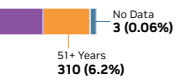
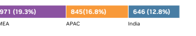
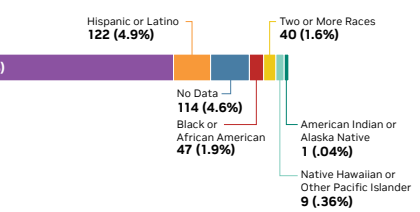
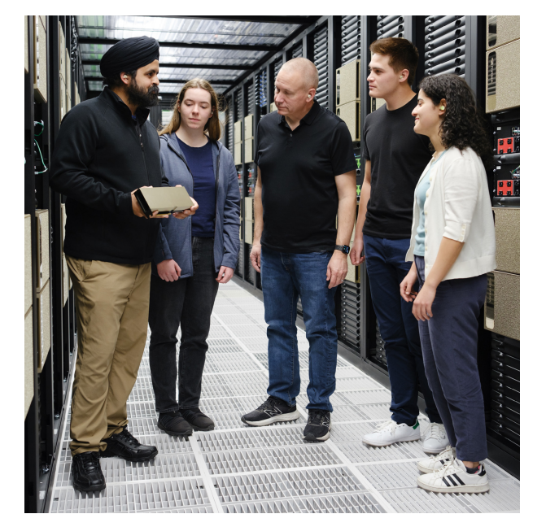
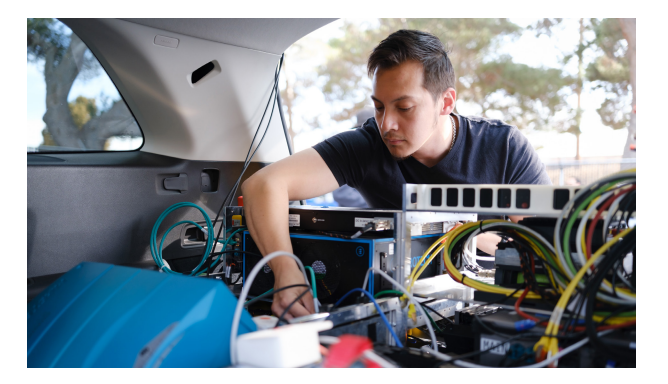
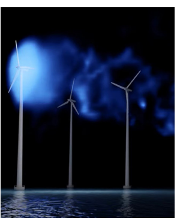
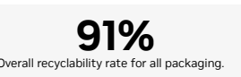

NVIDIA 
Corporate Responsibility Report Fiscal Year 2023

# Table Of Contents

## Message From Our Ceo Introduction Business Practices People, Diversity And Inclusion Sustainability

| Recruitment                         | 16                        | Product Energy Efficiency            | 34                                  |                                    |    |
|-------------------------------------|---------------------------|--------------------------------------|-------------------------------------|------------------------------------|----|
| Introduction                        | Benefits and Compensation | 18                                   | Greenhouse Gas Emissions Management | 36                                 |    |
| About NVIDIA                        | 05                        | Employee Engagement                  | 19                                  | Product Lifecycle Efforts          | 41 |
| Our Code and Values                 | 06                        | Learning and Development             | 21                                  | Accelerating Climate Action        | 42 |
| Corporate Responsibility Management | 08                        | Health and Safety                    | 22                                  |                                    |    |
| Retention                           | 23                        | Reporting Frameworks                 |                                     |                                    |    |
| Stakeholder Engagement              | 09                        | Workforce and Diversity Data         | 24                                  | GRI Index                          | 44 |
| Business Practices                  | SASB Index                | 53                                   |                                     |                                    |    |
| Supply Chain Management             |                           |                                      |                                     |                                    |    |
| Business Continuity                 | 11                        | TCFD Index                           | 56                                  |                                    |    |
| Human Rights                        | 11                        | Social and Environmental Performance | 27                                  | U.N. Sustainable Development Goals | 58 |
| Responsible Sourcing                | 30                        |                                      |                                     |                                    |    |
| Cybersecurity                       | 13                        |                                      |                                     |                                    |    |
| Data Privacy                        | 13                        | Products and Society                 |                                     |                                    |    |
| Product Security                    | 14                        |                                      |                                     |                                    |    |
| Product Quality and Safety          | 14                        | Societal Innovation                  | 31                                  |                                    |    |
| Customer Relations                  | 15                        | Trustworthy AI                       | 32                                  |                                    |    |
| Trade Issues                        | 15                        |                                      |                                     |                                    |    |

This report covers our fiscal year ended January 29, 2023 (FY23). Any reference to FY22 in this report refers to the report for our fiscal years ended January 30, 2022. All references to "NVIDIA," "we," "us," "our" or the "Company" mean NVIDIA Corporation and its subsidiaries. We've reported through the Global Reporting Initiative (GRI) publicly since 2010. We also disclose in accordance with the Sustainability Accounting Standards Board and Task Force on Climate-Related Financial Disclosures. We continue to align our social impact activities with the United Nations' Sustainable Development Goals. 

# Message From Our Ceo

The dawn of AI has arrived. Generative AI breakthroughs like ChatGPT, the AI heard around the world, are capturing the imagination of billions of people. The growing pace of advances is incredible. But this is just the tip of the iceberg. What lies below this explosion in consumer AI 
interest is a transformation of science and industry that is approaching light speed. The same large language models that can write a poem are being used today to battle disease. The algorithms that help us create an impressionist landscape from just a few words are being used to generate new chemicals and proteins to accelerate drug discovery.

## Nvidia Accelerated Computing Is Sustainable Computing

For nearly four decades, Moore's law has been the governing dynamic of the computer industry, predicting like clockwork the exponential growth in computing performance in tandem with moderate power and cost increases for decades. But as Moore's law has reached the limits of science, energy requirements are growing. Data centers are already about 1-2% of global electricity consumption and that consumption is expected to continue to grow. This continued growth is not sustainable, neither for operating budgets nor for our planet.

Accelerated computing is now the most sustainable way to advance computing. NVIDIA invented accelerated computing two decades ago to solve problems that normal computers can't. Through full-stack invention from chips, systems, networking, acceleration libraries, to refactoring applications, we can supercharge them at far better energy efficiency than traditional CPU computing. 

Acceleration is the best way to reclaim power and achieve sustainability and net zero.

› In the aerospace and electronics industries, simulating the flow of liquids and gasses is key to understanding turbulence in flight, or how to manage the heat created by a mobile phone. NVIDIA can reduce the costs of these computational fluid dynamics simulations by 9X and reduce energy consumption by 17X.

› In the semiconductor industry, computational lithography dramatically improves the precision of chip design. It's an emerging field but already consumes tens of billions of CPU hours annually. NVIDIA cuLitho accelerates this workload 40X over CPUs, with industry leader TSMC seeing a 10X reduction in power requirements.

› Our Earth-2 initiative will be a digital twin of the planet. This simulation will help predict the complex multi-physics of Earth's atmosphere, land, sea, and ice caps at sufficiently high resolution. This will enable us to better predict the regional impacts of human actions over decades.

Our innovation this year has been amazing, and it's paving the way for a more sustainable computing future.

› NVIDIA technologies now power 23 of the top 30 systems on the latest Green500 list.

› NVIDIA powers 90% of the new systems in the latest TOP500 list of the world's fastest supercomputers. This includes the NVIDIA H100-powered system deployed at New York's Flatiron Institute, which topped the Green500 list of the most-efficient systems.

› NVIDIA GPUs are typically 20X more energy efficient for certain AI and HPC workloads than traditional CPUs. If we switched accelerated computing workloads from CPU-only servers to GPU-accelerated systems worldwide, we estimate nearly 20 trillion watt-hours of energy savings a year, equivalent to the electricity requirements of nearly 1.9 million U.S. homes.

## Nvidia Ai Is Accelerating Healthcare

Working with our partners, we're also bringing entirely new AI capabilities to address challenges in healthcare. › NVIDIA and Medtronic, one of the world's largest healthcare technology providers, are partnering to build an AI platform for software-defined medical devices. This includes an AI-enhanced colonoscopy tool that detects 50% more lesions—improving the early detection of colorectal cancer, the second most common cause of cancer deaths in the U.S.

› Orthopaedic Relief Services International used NVIDIA Clara Holoscan to perform augmented reality-enhanced kidney cancer tumor removal in patients for the first time.

› A consortium of 10 National Health Service Trusts in the United Kingdom is deploying an NVIDIA MONAI-based platform across four of its hospitals, providing AI-enabled disease detection tools to healthcare professionals serving five million patients a year.

Our continued focus and advances have put us at the epicenter of this revolution. I'm inspired by what lies ahead.

## Nvidia'S Hyperdrive

The smartest, most creative experts in our field—our people—are NVIDIA's hyperdrive. We invest in them and their families and strive to make NVIDIA a place they can do their life's work and make positive change in the world.

Our culture of generosity and service is hard-wired. NVIDIA employees joined the company in contributing more than $22 million and 16,500 volunteer hours to charitable causes in fiscal year 2023. We've also raised $5 million to-date for humanitarian relief to Ukraine and its refugees. 

This was a breakthrough year for AI and for our company. We've advanced accelerated computing and AI incredibly over the years. And now our impact is expanding from the cutting edge of research into useful and impactful applications. AI's potential for humanity is incredible. Unlocking it will demand continued advances in accelerated computing, now the most sustainable way of computing, and simultaneous advancement of AI capabilities and safety. All of NVIDIA is aimed at making it so.

Jensen Huang, 

CEO and Co-Founder, NVIDIA

# Introduction

## About Nvidia

NVIDIA pioneered accelerated computing to help solve the most challenging computational problems. Since our original focus on PC 
graphics, we've expanded to several other large and important computationally intensive fields. Fueled by the sustained demand for exceptional 3D graphics and the scale of the gaming market, NVIDIA has leveraged its GPU 
architecture to create platforms for scientific computing, artificial intelligence, or AI, data science, autonomous vehicles, or AV, robotics, metaverse, and 3D internet applications. The GPU was initially used to simulate human imagination, enabling the virtual worlds of video games and films. Today, it also simulates human intelligence, enabling a deeper understanding of the physical world. Its parallel processing capabilities, supported by thousands of computing cores, are essential to running deep learning algorithms. This form of AI, in which software writes itself by learning from large amounts of data, can serve as the brain of computers, robots, and self-driving cars that can perceive and understand the world. 

NVIDIA has a platform strategy, bringing together hardware, systems, software, algorithms, libraries, and services to create unique value for the markets we serve. The programmable nature of our architecture allows us to support several multi-billion-dollar end markets with the same underlying technology by using a variety of software stacks developed either internally or by third-party developers and partners. The large and growing number of developers across our platforms strengthens our ecosystem and increases the value of our platform to our customers.

Innovation is at our core. We have invested over $37 billion in research and development since our inception, yielding inventions that are essential to modern computing. Our invention of the GPU in 1999 defined modern computer graphics and established NVIDIA 
as the leader in computer graphics. With our introduction of the CUDA programming model in 2006, we opened the parallel processing capabilities of our GPU for general purpose computing. This approach significantly accelerates the most demanding highperformance computing applications in fields such as aerospace, bio-science research, mechanical and fluid simulations, and energy exploration. In addition, the massively parallel compute architecture of our GPUs and associated software are well suited for deep learning and machine learning, powering the era of AI. While traditional CPU-based approaches no longer deliver advances on the pace described by Moore's law, NVIDIA accelerated computing delivers performance improvements on a pace ahead of Moore's law, giving the industry a path forward. NVIDIA is headquartered in Santa Clara, CA. As of January 29, 2023, we had 26,196 employees in 35 countries. 

## Our Code And Values Our Code

Our code of conduct outlines our core values and establishes the expectations we have about how we conduct business. It guides our actions in our professional relationships with fellow employees, and towards our customers, partners, competitors, vendors, government regulators, shareholders, and the community at large. Our code applies to all employees and directors and we expect all third parties we do business with, including consultants, contractors, and other service providers, to act in a manner consistent with it.

## Ethics Training

We strive to achieve the highest standards of ethical conduct in all our business dealings and are committed to promoting a culture of integrity. NVIDIA employees receive code of conduct, ethics, and preventing workplace harassment training upon hire and then every two years thereafter. Employees who have frequent contact with customers, partners, and suppliers (such as those in sales, finance, and procurement) have completed additional global anti-bribery and anticorruption training. As of January 2023, 99% 
of employees had completed these trainings.

## Investigations Process

Our commitment to promoting a culture of integrity means everyone is expected to act ethically and feel empowered to voice concerns without fear of retaliation. 

Any employee can confidentially and anonymously submit a complaint about any matter of concern including accounting, internal controls, auditing, code of conduct, harassment, conflict of interest, or other potential code of conduct or policy violations using our **Speak Up** corporate hotline which is hosted by an independent third party. 

By using an external organization, we ensure that our employees feel secure their reports will be anonymous. Employees are encouraged to report suspected code and other policy violations to their manager, a human resources representative, the legal department, and/or the anonymous hotline. 

We have a strict no-retaliation policy regarding good faith reports of activities that violate our code laws, regulations, and our policies. 

Our Compliance Committee, comprised of our CFO, EVP operations, and SVP of human resources, was formed by our Board of Directors (Board) to ensure communication of and adherence to NVIDIA's ethics policies; establish procedures for the receipt, retention and treatment of complaints received by the Company; and promptly and thoroughly conduct ethics-related investigations in partnership with relevant organizations within NVIDIA. The committee reports to the Boards' Nominating and Corporate Governance Committee (NCGC) and Audit Committee and escalates ethics complaints to those committees. The committee periodically reviews and assesses the effectiveness of its procedures and adjusts as necessary. Employees who wish to understand NVIDIA's investigations process have access to an online training course. 

Our CEO

Introduction Business

Practices

People, Diversity 

and Inclusion

Supply Chain

Management

Products 

and Society

Sustainability Reporting 

Frameworks

## Our Values

Our corporate culture arises from five core values, which provide the foundation for our success. These values create a workplace where innovation thrives and mistakes are transformed into opportunities.

## Nvidia'S Core Values

 Dream Big, Start Small. Take Risks, Learn Fast.

We make things that delight customers and raise industry standards. We encourage employees to innovate,  guided by first principles, not consensus.

Innovation We know our path to discovery will be paved with mistakes. We anticipate and avoid the ones we can. We accept, learn from, and share the ones that occur. This allows us to invent things the world doesn't even know it needs, and by doing so, invent the future.

## Seek Truth, Learn From Mistakes, Share Learnings.

We operate at the highest ethical standards. We seek to accurately know ourselves and our capabilities—acknowledging our weaknesses and learning from our mistakes.

Intellectual

Honesty The sharpest understanding of reality improves our work. Identifying the origins of mistakes is not about blame. It is essential to learning and constant improvement. We say what we believe, and have the courage to act on it.

## Learn, Adapt, Shape The World.

We are alert and constantly learning, and adjust course to align to new realities. This lets us create groundbreaking products at astonishing speed. No politics, no hierarchy stands in the way of inventing the future.

## Maintain The Highest Standards.

We hire extraordinarily talented individuals across the globe, people determined to make a difference. We challenge ourselves to do our best work.

Excellence & 

Determination We measure ourselves not against the competition, but against perfection—we call it the speed-of-light test. We are not deterred by lengthy endeavors if they are worthy. We are playing a long game.

## Do What'S Best For The Company.

We foster an environment of transparency, openness, and sharing information. One that motivates our employees, and empowers them to work as a single integrated team.

One 

Team We disagree openly and directly because conflict is essential to resolving differences, improving ideas, and achieving alignment. Our focus is on substance, not on style. By putting the interests of the company before our own, we can more easily accomplish NVIDIA's vision.

Speed &

Agility

## Corporate Responsibility Management

We conduct a formal assessment of our corporate responsibility impacts annually to identify our key social and environmental impacts, including an assessment of stakeholder expectations, market trends, and opportunities, as well as risks identified in our enterprise risk management process. The type of stakeholders we engage with and examples of our interactions can be found in the Stakeholder Engagement section. The determination of our corporate responsibility topics reflects the assessment of our impacts and stakeholder expectations and our review of frameworks and initiatives such as the Global Reporting Initiative (GRI), Sustainability Accounting Standards Board 
(SASB), the Task Force for Climate-Related Financial Disclosures (TCFD), and the United Nations Sustainable Development Goals (UN SDG). These topics reflect our values and social and environmental contributions, as well as matters we believe are essential to our continued business success. 

After our assessment, we added or revised the following topics in this year's report: Business Practices; People, Diversity and Inclusion; Supply Chain Management; Products and Society; and Sustainability. 

The results of this assessment and topics are reviewed by the NCGC of our Board. 

We address each of these topics in subsequent sections of this report. We define each topic, discuss why it's important to NVIDIA and how we manage it, and disclose relevant performance data. The discussion of topics included in this report and our other corporate social responsibility disclosures should not be read as implying that such topics are "material" in the context of the U.S. federal securities laws, Delaware General Corporation Law, or any other regulatory framework, even when we use words such as "material" or "materiality". Our approach to CR disclosures is informed by reporting frameworks, such as the GRI, that involve broader definitions of materiality than used for purposes of our compliance with SEC disclosure obligations. As a result, "materiality" for purposes of our CR 
reporting includes impacts on communities, the environment, and stakeholders such as employees, customers, and suppliers, and the inclusion of topics in our CR reporting, even when described as "material," does not indicate that such topics are material to our business, operations, or financial condition.

## Corporate Responsibility Governance

The NCGC is responsible for reviewing and discussing with management our policies, issues, and reporting related to corporate responsibility, including overall corporate responsibility strategy, risks and opportunities, and related programs and initiatives. Our corporate responsibility reporting team provides an update on these topics, as well as pertinent regulations and stakeholder inputs, and gathers feedback from the NCGC on issues such as climate change, human rights, and diversity and inclusion. The Compensation Committee of our Board is responsible for reviewing and discussing with management our policies and strategies relating to human capital management, which includes recruiting, retention, development, diversity and inclusion, and employment practices. The corporate responsibility reporting team updates the NCGC, and their feedback combined with executive input, helps to determine annual program direction. In FY23, our NCGC reviewed our climate change position and continued investor interest in net zero strategies, science-based targets, and human rights related to the third-party use of our products. The Compensation Committee received an update on diversity and inclusion efforts and progress across several initiatives. At the end of FY23 our Board was briefed in both areas.

| Message From   | Introduction   | Business      | People, Diversity   | Supply Chain   | Products   | Sustainability   | Reporting   |
|----------------|----------------|---------------|---------------------|----------------|------------|------------------|-------------|
| Our CEO        | Practices      | and Inclusion | Management          | and Society    | Frameworks |                  |             |

## Stakeholder Engagement

We define stakeholders as entities or individuals who can be affected by NVIDIA and whose actions can affect the Company. We receive feedback regularly on the topics that matter to stakeholders, and we focus our engagement efforts accordingly. 

| Stakeholder                          | FY23 Interactions                                                                                                                                                                                                                                                                                                                                                                                                                                                                                                                                                                                                                                                                                                                                                                                                                                                                                                                                                                                                                                                                                                                                                                                                                                                                                                                                                                                                                                                     |
|--------------------------------------|-----------------------------------------------------------------------------------------------------------------------------------------------------------------------------------------------------------------------------------------------------------------------------------------------------------------------------------------------------------------------------------------------------------------------------------------------------------------------------------------------------------------------------------------------------------------------------------------------------------------------------------------------------------------------------------------------------------------------------------------------------------------------------------------------------------------------------------------------------------------------------------------------------------------------------------------------------------------------------------------------------------------------------------------------------------------------------------------------------------------------------------------------------------------------------------------------------------------------------------------------------------------------------------------------------------------------------------------------------------------------------------------------------------------------------------------------------------------------|
| Customers                            | Consistent with full category membership in the Responsible Business Alliance (RBA), we completed self-assessment questionnaires and other related surveys for customers. We participated in quarterly business reviews with key customers. We reported carbon emissions data to the Carbon Disclosure Project (CDP), requested by thirteen customers.                                                                                                                                                                                                                                                                                                                                                                                                                                                                                                                                                                                                                                                                                                                                                                                                                                                                                                                                                                                                                                                                                                                |
| Employees and  Prospective Employees | We conducted pulse surveys on the topics of life's work, engagement, and thriving at work. The surveys repeatedly tell us that our employees would recommend NVIDIA as a  great place to work.  We are recognized among the top five large U.S. employers on Glassdoor's Best Places to Work list, which is based on employee reviews regarding positive workplace culture,  strong pay and benefits, flexibility, and more.                                                                                                                                                                                                                                                                                                                                                                                                                                                                                                                                                                                                                                                                                                                                                                                                                                                                                                                                                                                                                                          |
| Governments                          | We continued engagements with the U.S. House and Senate AI Caucus, the Congressional Tech Staff Association, and key officials in the legislative and executive branches on  issues that impact NVIDIA's public policy priorities, such as AI development and semiconductor design.  We engaged with stakeholders in the European Commission, European Parliament and Council of the European Union on the development of policy issues and key regulatory  filings in the EU. Accordingly, NVIDIA is listed in the EU Transparency Register. We submitted to the U.S. government a blueprint for how the U.S. could build its chip manufacturing ecosystem leveraging advanced technologies such as digital twins, a  highly-skilled workforce, and investments in energy-efficient technologies.  We participate in the Semiconductor Industry Association's development and advocacy efforts, including investment in the U.S. workforce and federal R&D programs.  We engage with the work of our European trade associations, including DigitalEurope, Bitkom and techUK, to help inform the evaluation of regulation governing complex  technologies such as AI, high performance computing (HPC) and the metaverse. Through our ongoing work with the Financial AI Cluster (FAIC), affiliated with the Gaia-X initiative, we're accelerating the development of trustworthy and explainable AI  techniques for application in the financial services industry. |

Our CEO
Introduction Business Practices People, Diversity and Inclusion Supply Chain Management Products and Society Sustainability Reporting Frameworks

| Stakeholder                           | FY23 Interactions                                                                                                                                                                                                                                                                                                                                                                                                                                                                                                                                          |
|---------------------------------------|------------------------------------------------------------------------------------------------------------------------------------------------------------------------------------------------------------------------------------------------------------------------------------------------------------------------------------------------------------------------------------------------------------------------------------------------------------------------------------------------------------------------------------------------------------|
| Nongovernmental  Organizations (NGOs) | We signed on to the UN Global Compact to demonstrate our commitment to upholding human rights. We hosted the United Nations at our developer conference to discuss AI and deep learning to assess and mitigate the impact of climate change and human activities on our  planet. We co-chair the OECD Taskforce on AI Compute and presented at COP27 on sustainable computing.                                                                                                                                                                             |
| Shareholders                          | We discussed corporate responsibility topics with several shareholders holding 1% or more of our common stock during our annual outreach meetings. Topics covered  included: climate change, diversity and inclusion at the Company and board level, board involvement in corporate responsibility, and customer due diligence with our AI  product sales. We launched a quarterly investor call on corporate responsibility to respond to requests from global shareholders. Topics discussed included climate change, human rights,  and trustworthy AI. |
| Suppliers                             | We performed a Responsible Business Alliance (RBA) risk assessment on all strategic suppliers by geography and type of industry. We reviewed Validated Assessment Program (VAP) audits on 25% of our strategic suppliers, bringing total coverage in the past two years to 93%. We continued to support suppliers dealing with impacts of COVID-19 through utilizing remote VAP audits for qualifying facilities and working with our suppliers regarding any  International Organization for Standardization (ISO) or RBA VAP audit delays.               |

Our CEO

Introduction Business

Practices

People, Diversity 

and Inclusion

Supply Chain

Management

Products 

and Society

Sustainability Reporting 

Frameworks

# Business Practices

## What It Covers:

› Business Continuity › Human Rights
› Cybersecurity › Data Privacy 
› Product Security
› Product Quality and Safety
› Customer Relations › Trade Issues Below we cover management of 

 several important business practices discussed with stakeholders in FY23. 

## Business Continuity

Our business continuity management 
(BCM) philosophy is to identify realistic threats and their potential impact on our core values and business operations and design a formal framework for responding.

We achieve resilience by embedding redundancy and diversity into our response framework. A BCM steering committee of four executives is supported by cross-functional business leaders across the following functions: Corporate Communications, Cybersecurity, Facilities, Finance, Global Security, Human Resources, Information Technology, and Operations. Each function has a plan to identify and address potential risks.

These efforts are supported by robust infrastructure, systems, policies, and procedures that are designed to mitigate risk and protect our employees and customers when unexpected events such as a cyberattack, business disruption, or natural disaster occur.

BCM is critical to minimizing financial and reputational impacts. By anticipating the likelihood of severe events, we can mitigate these risks and ensure that the Company doesn't experience preventable damages.

## Human Rights

This section discusses how we manage human rights broadly, in our supply chain and in relation to our products.

## Oversight And Governance

The NCGC has oversight of policies and practices in connection with human rights and provides periodic updates to the Board. Management undertakes all actions it deems reasonable and necessary to ensure compliance with our **Human Rights Policy**. We regularly assess human rights-related risks and potential impacts, review our policies and management processes, and seek input from stakeholders on our approach.

## Human Rights Principles

We follow the laws of the countries in which we operate, and endorse internationally recognized principles, including: › United Nations Global Compact
› United Nations Guiding Principles › **Universal Declaration of Human**
Rights
› **International Covenant on Civil and**
Political Rights
› **International Covenant on Economic,**
Social and Cultural Rights
› Core Conventions of the International Labour Organization
› **ILO Declaration on Fundamental**
Principles and Rights at Work All our employees are required to complete training on our code, which includes our commitment and guidelines to respect human rights. Employees can confidentially and anonymously report a concern about human rights using our **Speak-Up line**, 
which is available in seven languages.

Our Compliance Committee will promptly investigate human rights allegations and pursue actions to mitigate and remediate any adverse human rights impacts. We do not tolerate retaliation against anyone for making a complaint in good faith, bringing a potential violation to the attention of management, or participating or assisting in an investigation. 

In FY23, NVIDIA **joined** the UN Global Compact to help assess and communicate our human rights efforts, among other environmental and social issues. We are also a member of the Responsible Labor Initiative (RLI), the PublicPrivate Alliance for Responsible Minerals Trade 
(PPA), and the Responsible Minerals Initiative.

## Human Rights In Our Supply Chain

We expect our suppliers to maintain progressive employment, health, safety, and ethical practices that meet or exceed applicable laws, the **RBA Code of Conduct**, our **CSR Directive**, our **code of conduct**, and our **Human Rights Policy**. We also encourage suppliers to use the RBA Code of Conduct as a platform to go above and beyond compliance. 

We participate in RBA's Responsible Labor Initiative and monitor our supply chain through Validated Assessment Program (VAP) audits, which cover freely chosen employment, child labor, and freedom of association. We reviewed VAP audits on 25% of our strategic suppliers, bringing total coverage in the past two years to 93%. If we were to uncover findings during these audits, we would work directly with suppliers to implement any corrective actions. In FY23, we oversaw the remediation and repayment by suppliers of fees to workers who were discovered through audits to have paid recruitment fees. We take the issue of forced labor very seriously and conduct regular audits to ensure all workers in our supply chain are treated with respect and dignity. To help eliminate forced labor from global supply chains, we are full members of and work with industry groups like the RBA. Through the RBA, we also work with expert organizations, NGOs, and academia to advance our program and standards, and we plan to support efforts at an industry level to identify and remediate actual and potential cases of labor and human rights abuse. Our supplier audits have not identified incidents of forced Uyghur labor, but we recognize that the risk remains. 

In FY23, we assigned the following RBA 
Learning Academy courses to our suppliers: 
Working Hours (Basics), Working Hours Management System, Managing Wages 
(Basics), Creating Motivating Wage Systems, The Hiring Process (Basics), Recruitment and Selection, and Working with Labor Brokers.

We are committed to enabling worker voice and facilitating access to effective justice and remedy. Anyone, including suppliers and other external stakeholders, can confidentially and anonymously report a concern about human rights using our **Speak-Up line**.

Read more about human rights in our supply chain in our **Responsible Sourcing** section.

## Product Due Diligence

We believe AI will enhance human welfare and human rights in a myriad of ways. NVIDIA is accelerating the AI revolution by creating platforms and computing tools that help developers, researchers, and data scientists innovate in these areas.

When we create new products, platforms, or services, we have an interdisciplinary team evaluate whether our offerings could be used in conflict with our **Human Rights** Policy and provide recommendations to minimize any such risk.

Our products are programmable and general purpose in nature. When we provide tools to help developers create applications for specific industries, we focus on creating products and services that enable developers to create and accelerate socially beneficial applications.

## Cybersecurity

Our information security and cybersecurity practices comprise the physical, procedural, and technical safeguards we take to protect confidential information entrusted to us from unauthorized access or attack, as well as measures designed to secure NVIDIA 
products and services while protecting data privacy. As we monitor security attacks against our shared ecosystem and become aware of more frequent high-profile security breaches across the technology industry, we continuously evolve our strategies and remain committed to implementing vigorous protections for any information we collect. We established a cross-functional leadership team, consisting of executive leaders, that meets monthly to review cybersecurity metrics and evaluate emerging threats. 

To ensure a robust breadth of knowledge, the team consults with external parties, such as computer security firms and risk management and governance experts. With oversight and guidance provided by the crossfunctional leadership team, our information security and cybersecurity teams continually refine our practices to address emerging security risks and changes in regulations. The Board is committed to strong and meaningful privacy and data security protections. Our Chief Security Officer and other management in cybersecurity and data privacy presents annually to our Board and provides updates throughout the year as needed. These leaders also update the Audit Committee quarterly. Our information security management program follows processes outlined in frameworks such as the ISO 27001 international standard for Information Security. We address cybersecurity scenarios in our resilience planning, document them through business continuity plans, and test the reliability of our products and services, and our ability to respond to threats through attack simulations. Against the backdrop of frequent changes and fresh insights, we continually evaluate and evolve our security measures. In the event of a cybersecurity issue, we've prescribed a set of actions for teams to initiate that will help us to determine the type and rigorousness of our response.

Cybersecurity awareness training is required for all new hires, and annually for all employees. Our cybersecurity team has implemented extensive training internally on the risks of phishing. This includes conducting simulated phishing campaigns across the Company quarterly to measure and improve awareness. The team provides further training for departments that have the least adequate responses. Cybersecurity leadership presents quarterly to the Audit Committee, annually to the Board, and provides updates throughout the year as needed.

## Data Privacy

We continuously hone our cybersecurity and data privacy trainings and policies to respond to new requirements in global privacy laws. Our relationship with our colleagues, customers, and business partners is based upon mutual trust. We're committed to maintaining this trust by protecting the information we hold from inappropriate use, unauthorized access, loss, and accidental destruction.

NVIDIA is governed by the following privacy policies, consistent with the EU's General Data Protection Regulation (GDPR), and applied globally:
› Our customer-facing **NVIDIA Privacy Policy**, 
which incorporates both a **Cookie Policy** and a Children's **Privacy Policy**.

› A collection of internal, corporate data privacy policies focused on compliance with global privacy laws and regulations.

› An Employee Privacy Policy and an **Applicant** 
Privacy Policy.

Our privacy policy describes how we collect, use, store, share, and protect customer data, as well as how customers can access and manage their personal data. 

We are committed to upholding the legal protections safeguarding the privacy of our customers' data. Our employees are required to complete information security awareness training and to comply with our information security and privacy policies.

## Product Security

We take security concerns seriously and work to evaluate and address them quickly. As soon as a security concern is reported, we commit all relevant resources to analyze, validate, and, if needed, provide corrective actions to address the issue. NVIDIA **Security Bulletins**
and Notices are published on our website. The NVIDIA Product Security Incident Response Team (PSIRT) is a global team that manages the receipt, investigation, internal coordination, remediation, and disclosure of security vulnerability information related to NVIDIA products and services. PSIRT's goal is to minimize the risk to customers associated with security vulnerabilities by providing timely information, guidance, and remediation of vulnerabilities in our products and services. 

The PSIRT team integrates elements of the NIST Cybersecurity Framework and controls into its security program. We participate in the global Forum of Incident Response and Security Teams (FIRST.org), contribute to FIRST.org Special Interest Groups (SIGs) to make improvements to PSIRT processes, and share process knowledge with others so they may implement this type of notification and security work within their own organizations. 

We also participate in MITRE's Cybersecurity and Vulnerability Exposure Number Authority Coordination Working Group and partner with third-party research institutions and corporate peers to extend the MITRE ATT&CK framework for AI to advance the industry's security and its response to new and upcoming threats.

## Quality Standards

NVIDIA is ISO 9001 certified and has been issued a "letter of conformance" to the IATF 16949 automotive quality standard.

## Product Quality And Safety

Safety is a principle that permeates our engineering culture. We incorporate it into every step of our product development process, from design and production to the end-user experience. The safety of our customers—inclusive of our partners and consumers—is of critical importance to our Company. Our products undergo rigorous qualification and testing to ensure compliance with customer safety and compliance standards like UL/IEC 62368 Ed3. With these standards in mind, we've established product safety technical committees to oversee safety throughout the product lifecycle.

Cross-functional teams manage all aspects of product quality, with the goal being to exceed customer expectations. Customer quality engineering provides direct customer support for all quality-related issues and facilitates the gathering of customer failure information, customer-observed failure rates, and returned material authorization processing. 

As part of the continuous improvement process, recommended design enhancements are brought to the design engineering teams for incorporation into next-generation products. Our quality management system is monitored through internal audits and an annual third-party **ISO 9001** assessment. 

We engage with strategic suppliers on quality issues through quarterly business reviews (QBRs) and use these reviews to influence business allocation decisions. 

## Autonomous Vehicle Safety

As an automotive solutions provider, we make safety our top priority, incorporating it into every step of our autonomous vehicle development process—from design and production to operation.

We develop tools and methods so technologies will perform reliably. Stringent safety processes are built into the **NVIDIA** DRIVE autonomous vehicle platform, enabling automakers and tier-1 suppliers to accelerate their production of autonomous vehicles. Our safety priorities and processes are outlined in our latest **Self-Driving Car Safety Report**. NVIDIA has been working with TÜV SÜD, a top safety assessment company, to assess and certify NVIDIA's processes, concept architectures, and products. **In 2022** TÜV 
SÜD determined that the NVIDIA DRIVE OS operating system for in-vehicle accelerated computing meets the International ISO 26262 ASIL B standard, which targets functional safety, or "the absence of unreasonable risk due to hazards caused by malfunctioning behavior of electrical or electronic systems." Building on our investment in automotive safety, we're expanding functional and system safety toward autonomous machines in general, such as robotics, industrial edge AI, and healthcare. We consider and apply requirements of specific standards such as ISO 13849 and IEC 61508 in our product research, development, and engineering functions.

## Customer Relations

Our customers include large electronics, consumer brand, and automotive companies. Consequently, we've integrated the standards outlined in the RBA Code of Conduct covering labor, human rights, environment, health and safety, ethics, and management systems throughout our global operations. These standards guide our management approach for our supply chain. Inquiries from our original equipment manufacturer partners and cloud service providers have increased in line with expectations of supplier responsibility and environmental sustainability. 

Some customers employ quarterly business reviews and assign points on their scorecards for environmental and social performance. Customers who are RBA 
members monitor our performance through tools such as the RBA-Online platform and self-assessment questionnaires. Customers also request our participation in the CDP climate change and water surveys each year. In FY23, we completed the EcoVadis survey which had been requested by customers to better understand our sustainability performance. 

## Full Material Disclosure

We maintain Full Material Disclosures (FMD) for our chip designs and select system products, which demonstrates our compliance with restricted substances when required including halogenated flame retardants, arsenic, and beryllium. Information on materials we use is reported through various platforms, including Substances of Concern in Products and International Material Data System for automotive. We continue to expand our FMD program, covering the majority of NVIDIA products in FY23.

## Electronic Product Environmental Assessment Tool

The Electronic Product Environmental Assessment Tool (EPEAT) program independently verifies the environmental impact of electronic products and is used by thousands of private and public institutional purchasers around the world to make sustainable IT procurement decisions. All NVIDIA chips and graphics cards support EPEAT conformance, and we provide information to customers seeking to register their products with the program.

## Trade Issues

Our semiconductor wafers are manufactured, assembled, tested, and packaged by third parties located outside of the United States, and we generated 69% of our revenue during FY23 from sales outside of the United States. The global nature of our business subjects us to a number of risks and uncertainties, which have had in the past and could in the future have a material adverse effect on our business, financial condition and results of operations, including: › Domestic and international economic and political conditions between countries in which we and our suppliers and manufacturers do business.

› Government lockdowns to control case spread of COVID-19 or other global or local health issues.

› Differing legal standards with respect to protection of IP and employment practices.

› Domestic and international business and cultural practices that differ.

› Disruptions to capital markets, counterinflation policies, and/or currency fluctuations.

› Natural disasters, acts of war or other military actions, terrorism, public health issues, and other catastrophic events.

NVIDIA's global Trade Compliance Team helps ensure that applicable international trade laws are followed when NVIDIA's products and technologies are transacted internationally and domestically. With local presence in the U.S., APAC and EMEA, team members serve as subject matter experts on the range of global trade issues that impact our business. The team helps clear NVIDIA's international shipments, performs restricted party screening, advises on import and export requirements, sets policies and procedures, and obtains import or export licenses and permits when required. They also stay current on new trade regulations and interpretations in the jurisdictions where we operate and ensure NVIDIA has processes in place to comply with evolving requirements.

# People, Diversity And Inclusion

## What It Covers:

› Talent attraction, recruitment, and retention, including diversity considerations 
› Competitive wages, benefits, and support › Work environment, company culture, and work-life balance
› Executive and workforce diversity
› Professional and leadership development and training
› Pay and promotion parity › Health and safety policies, programs, and performance NVIDIA ranked No. 5 on Glassdoor's 15th annual 

 Best Places to Work list for large U.S. companies. The award is based on anonymous employee feedback and includes thousands of companies.

Our employees are our greatest asset and play 

 a key role in creating long-term value for our stakeholders. Diverse teams fuel innovation, and we're committed to creating an inclusive culture that supports all employees, regardless of gender, gender identity or expression, veteran status, race, ethnicity, or disability. 

## Recruitment

The demand for talent in new markets such as AI and deep learning is high and increasing. 

To develop our candidate pipeline, we partner with higher education institutions and professional organizations, recruit at industry conferences, and encourage our employees to submit referrals—with over one third of hires coming from internal recommendations. To identify and attract global talent, we promote NVIDIA's employer brand, create opportunities in new geographies, and provide increased flexibility for employees to work from the location of their choice.

Several recruiters are dedicated to assisting women and members of the Black/African American, Hispanic/Latino, and veteran communities through the interview process. 

We have also embedded inclusion recruiting partners throughout the business to help align candidates with internal opportunities. To diversify our college pipeline, we established the NVIDIA Ignite program, which prepares first- and second- year college students for an NVIDIA internship the following summer. We saw a 100% increase in applications for the FY23 Ignite program. 

Our recruitment efforts in the U.S. attracted many underrepresented applicants through virtual university and professional career events. The FY23 MBA internship program was comprised of 50% students from underrepresented communities.

Other recruiting actions: › Provide a guide for unbiased recruiting and hiring to managers and interviewers.

› Partner with community resource groups to improve how we reach qualified candidates.

› Guide candidates from underrepresented communities through the interviewing process.

› Provide candidates the option to speak with employees from their communities about the employee experience and Company culture.

› Study our recruiting pipeline regularly to identify and remove potential bottlenecks for diverse candidates.

In FY23, we continued to recruit at universities virtually, with 50% of events inclusion focused, enabling us to reach 22% 
more universities compared to FY22.

## Fy23 Hiring Data*

| 2,216 (44%)        | 2,512 (49.83%)   |
|--------------------|------------------|
| 20-30 Years        | 31-50 Years      |
| By Gender (Global) | 1,001 (19.9%)    |
| Male               | Female           |
| 3,947 (78.3%)      |                  |

## By Region (Global)

| 2,579 (51.2%)                                              | 971 (19.3%)       | 845(16.8%)                                             | 646 (12.8%)       |
|------------------------------------------------------------|-------------------|--------------------------------------------------------|-------------------|
| Americas                                                   | EMEA              | APAC                                                   | India             |
| Hispanic or Latino                                         | Two or More Races |                                                        |                   |
| 122 (4.9%)                                                 | 40 (1.6%)         |                                                        |                   |
| By Race/Ethnicity (United States of America) 1,308 (52.7%) | 843 (33.9%)       |                                                        |                   |
| Asian                                                      | White             | No Data 114 (4.6%) Black or African American 47 (1.9%) | 1 (.04%) 9 (.36%) |
| * Numbers do not equal 100% due to rounding.               |                   |                                                        |                   |

## Benefits And Compensation

We believe in a comprehensive benefits program that we offer worldwide. Our employees and their families and their welfare are a top priority. Our comprehensive benefits program includes a 401(k) program in the U.S., 
statutory pension programs outside the U.S., 
an employee stock purchase program, flexible work hours and time off, and programs to address mental and physical well-being. We seek to make sure that all employees and their families have access to quality healthcare. 

We evaluate our benefit offerings annually to ensure they are meeting the needs of our employees and continuously seek feedback from employees to advance our support. We provide employees with benefits such as full-cost reimbursement for adoption, surrogacy, and fertility treatment expenses. 

Our parental leave program is one of the most generous in the industry, enabling birth parents to take up to 22 weeks of fully paid leave, starting as early as four weeks before their due date. Nonbirth parents get up to 12 weeks of fully paid leave. To ease the transition back to work after their leave, all new parents also receive up to eight weeks of flex time. All employees also have access to parenting support modules that provide tips and guidance.

We partner with NVIDIA's nine different community resource groups to tailor support programs based on targeted needs, including expansion of military leave for members of the military, expanded gender affirmation support, enhanced health insurance coverage for members with developmental delays, and enhanced mental health counselor search tools. To give employees time to recharge, we will provide eight free days in 2023. These global scheduled days off are intended to be a time when all NVIDIANs disconnect and recharge.

## Health And Critical Support

A cross-functional team provides high-touch support to help employees or their family members through difficult times, such as a natural disaster, war, or other crises. The focused support will vary and can cover financial, travel, and medical care needs. We provide Family Care Leave in the U.S. with 12 weeks of fully paid leave for the care of family members. 

## Workplace Choice

We support a hybrid work environment, understanding that many employees want the flexibility to come to the office or work from home, and make that decision based on the conditions around them at any point in time. 

## Well-Being Support

Our employees' well-being is a top priority, and we aim to help them. We offer a suite of well-being services where people can choose what works best for them. Efforts include: › Employee Assistance Program offering free and confidential counseling. 

› NVIDIA-dedicated licensed counselors. › A digital platform with dedicated consultation with parenting experts. 

› Group counseling for in-the-moment crisis support.

› Global well-being champions to ensure our program and content are region-relevant and inclusive. 

› A peer-to-peer support program where NVIDIANs are trained to triage mental health situations. 

## Pay Parity

We ensure strong pay for all employees through an annual review of peer compensation in the markets we operate in and annual adjustments to employee compensation. Employees are provided both cash and equity compensation. Equity compensation is provided through restricted stock units (RSUs) that vest over time and provide value aligned to our stock price. We believe RSUs promote retention and align with stockholder interests. 

Cash compensation adjustments are determined based on market compensation growth and individual performance.

To ensure pay parity, defined as no statistically significant differences in compensation based on gender, race, or ethnicity, we've used a 

| Pay Ratio                             | FY23        | FY22        | FY21        |
|---------------------------------------|-------------|-------------|-------------|
| Women | Men (Global)                  | 99.5 | 100  | 99.0 | 100  | 98.2 | 100  |
| Asian | White (U.S.)                  | 100.1 | 100 | 100.2 | 100 | 98.7 | 100  |
| Black/African American | White (U.S.) | 101.5 | 100 | 102.4 | 100 | 101.9 | 100 |
| Hispanic/Latino | White (U.S.)        | 99.2 | 100  | 98.5 | 100  | 98.3 | 100  |

## What Our Employees Say

I'm proud to tell others I work here.

Management is honest and ethical in its business practices.

Employees say this is a great place to work Survey results from Great Place to Work. We rank No. 5 on Fortune 100 Best Companies to Work For in 2022.

third-party firm to analyze our pay practices across rating, education, years of experience, job function, family, and level. We've achieved pay parity for the past several years and plan to continue doing so. If the review were to identify a statistically significant issue, we would take corrective action.

## Employee Engagement

To ensure our continued success, we maintain a working environment where our employees are engaged and inspired.

## Feedback

We listen to employees through frequent pulse surveys that measure engagement levels and culture against their experiences as we continue to grow. This agile approach allows us to hear from employees more frequently and stay focused on specific areas, while reacting quickly to current events.

FY23 survey topics included Life's Work, Engagement, and Thriving at Work. The surveys repeatedly told us that our employees would recommend NVIDIA as a great place to work. 

In addition, we receive feedback through an internal portal where all employees can submit, view, and vote on suggestions. Our CEO responds to questions from employees during our quarterly Company meetings.

## Community Resource Groups

We support nine community resource groups 
(CRGs), which have executive-level sponsorship and dedicated budgets: Asian Pacific Islander, Black NVIDIAN Network (BNN), Early Career Network (ECN), Hispanic-Latino Network, NV Pride (LGBTQ+ employees and allies), 
NVIDIA Disabilities Network (NDN), NVIDIA 
Veterans, South Asian & Allies, and Women in Technology (WIT). In FY23, the ECN, WIT, 
and NVPride CRGs expanded into additional regions, reaching more employees globally. Human resources and CRGs have partnered on many programs, including: 
› Friend@NVIDIA, where new hires connect to CRG members who serve as cultural advisors, helping employees accelerate their ability to thrive at NVIDIA. 

› BNN and HLN mentored undergrads as part of our Ignite internship program. 

› Our health plan partner Cigna invited Black physicians and mental health providers used by NVIDIANs to join Cigna's network.

› NDN supports ADHD NVIDIANs, who meet to discuss experiences in a safe and neurodiverse-friendly environment. It also formed the Parents and Caregivers Support group.

› NVPride worked to **expand** resources for gender affirmation events. And employees can now voluntarily share personal pronouns in the Company directory.

## Community Engagement

Our primary community engagement initiative is Inspire 365, which aims to empower all NVIDIANs to get involved in their communities. Inspire 365 makes it easy for employees to contribute where, when, and how they choose through matching gifts, flexible time off, and a variety of activities and tools. Our collective, yearround efforts allow us to help those in need and strengthen communities around the globe.

## Inspire 365 Performance

| FY23                                                                               | FY22   |     |
|------------------------------------------------------------------------------------|--------|-----|
| Percentage of NVIDIANs engaged  in the NVIDIA Foundation's Inspire  365 initiative | 37%    | 37% |

| Amount of employee donations   | $8,818,629   | $9,117,126   |
|--------------------------------|--------------|--------------|

| Unique volunteer rate   | 10%   | 7%   |
|-------------------------|-------|------|

| Number/value of volunteer hours   | 28,865 /   |
|-----------------------------------|------------|
| $2,426,279*                       | 16,549 /   |

* Amount increased in FY23 due to growth in skills-based volunteering engagements, which are valued at a higher rate.

## Inspire 365 Contributions

Nearly 40% of our employees participated in the Foundation's Inspire 365 efforts during FY23, bringing the unique participation rate since the initiative's start to 71%. In all, employees donated more than $8.8 million and logged nearly 29,000 volunteer hours through individual, virtual, and in-person efforts. Together, NVIDIANs and the Company contributed $22.5 million in charitable giving in FY23, supporting more than 5,800 nonprofits in 55 countries around the world.

## Global Giving

When the war in Ukraine began, employees sprang into action to help with relief efforts. 

NVIDIANs around the world gave generously through a Company-wide fundraising campaign that directed more than $4.6 million in donations and Company and executive matching to nonprofits providing humanitarian aid. This generosity continued throughout the year and culminated with a global holiday giving campaign—Kindness is Our Superpower—which encouraged employees to spread kindness and help those in need by volunteering, donating, or taking small actions to lift the spirits of others. 

Over five weeks, thousands of NVIDIANs participated, volunteering 6,800 hours and contributing more than $4.2 million in donations and Company matching funds.

## Skills For Impact

We launched the Skills for Impact volunteering initiative to make it easier for NVIDIANs to find opportunities that incorporate their professional skills. Through short-term, flash-style consulting events, more than 100 employees, including department teams and our community resource groups, worked in small groups to help 18 nonprofits with strategic projects aimed at improving their services, reaching a broader community, or attracting new donors. 

The initiative also supported a cohort of 45 NVIDIANs looking to take nonprofit involvement to the next level by serving on a board. 

## Learning And Development Learning

Being a lifetime learner is core to our culture. 

We curate learning libraries to develop the skills of our employees and provide them with the latest platforms to support self-paced learning. We offer tuition reimbursement, subsidize advanced education programs, and sponsor online certifications. We learn through our peers, by hosting our annual NTECH conference where employees share their work with each other. In FY23, NVIDIA employees logged over 260,000 hours of learning, approximately 10 hours per employee. We continued an allyship program to establish and train a network of allies who can speak up when they see non-inclusive behavior and advocate for changes that lead to increased equity. We also created online diversity and inclusion educational resources for managers and employees.

In FY23, we piloted the Stride mentoring program with 20 mentee/mentor pairings from across our diverse community resource groups. 

The focus is on early-career employees to help build development pathways and navigate the Company. The program continues this year with 200 pairs across all NVIDIA regions.

## Career Development

To support employee advancement, we provide on-the-job training through coaching, feedback, and role modeling. We encourage internal mobility through career expos and our Career Chats service, as well as foster mentorship connections and provide trained coaches as additional developmental support. We launched a women's leadership development program to promote career conversations, foster connections with sponsors, and help participants leverage their strengths and hone skills to elevate their careers. Another effort was Pathway to AI, a skills-development and job-shadowing program for women engineers to boost their AI and machine learning competencies. 

We established Careers Week, a series of development sessions for employees to build new skills, understand their strengths, and learn how to advance their careers at the Company, and we expanded the program into EMEA and Israel. Additional development actions include strengths-based training for managers, a process for identifying future talent, and customized learning experiences for our community resource groups.

## Promotion Parity

We are committed to providing equitable opportunities for advancement to all employees and achieving promotion parity across dimensions of gender, race, and ethnicity. In FY23, we promoted 14% of our workforce. Women continue to be promoted at an approximately equal rate to men, 13.9% compared to 14.2%.

We engaged a third party to analyze promotion activity, which we've been doing since 2020. The review analyzed the actual and expected rates of promotions, as well as time to promotion, by gender, race, and ethnicity. 

There were no statistically significant differences between actual and expected promotion rates. If the review were to identify an issue of statistically significant promotion disparity, we would take corrective action.

## Health And Safety

Our Health and Safety (H&S) team oversees workplace conditions for NVIDIANs globally. We conduct external audits and internal inspections of our facilities. H&S team members provide guidance to ensure that facilities meet or exceed local safety requirements, promote safe work practices, and support compliance with applicable health and safety legislation and policies through trainings, communications, and audits. Our H&S framework includes: › A network of office-level committees and site safety officers.

› Globally applicable programs on topics including ladder safety, ergonomics, vehicle safety, and chemical management.

› Role-specific online training courses such as hazardous waste, data center safety, lab safety, and site safety officer training.

We identify and assess hazards and risks 

through routine inspections, audits, incident reporting, and investigations. Incidents and the results of incident investigations are recorded in our global security database. Our processes for hazard assessment and incident investigation are documented in our Illness and Injury Prevention Program. Employees across our global sites volunteer to participate in our emergency response team. These volunteers assist with evacuation drills and may receive training in basic first aid, CPR, AED, or fire extinguisher use, in addition to emergency preparedness. Our record reflects the results of our dedication to employee health and wellness. Less than 1% of leave-of-absence requests within NVIDIA relate to work, and workrelated injury losses are significantly below the averages for our industry. In the U.S., we track experience modification rates at the state level, all of which were less than one in FY22. We offer employee ergonomics programs and online courses.

Our CEO
Introduction Business Practices People, Diversity and Inclusion Supply Chain Management Products and Society Sustainability Reporting Frameworks

## Retention

We want NVIDIA to be a place where people can build their careers over their lifetime. NVIDIA's overall turnover of 5.3% remains low, compared with the semiconductor industry average of 19.2%. The turnover rate for women and men has been similar in the past several years. In the U.S., retention rates for members of underrepresented communities have held equal to their peers.

## Employee Health And Safety Performance

| Metric                                 | FY23   | FY22   | FY21   |
|----------------------------------------|--------|--------|--------|
| Lost-time incident rate (U.S.)         | 0.01   | -      | -      |
| Total recordable incident rate (U.S.)* | 0.10   | 0.06   | 0.07   |
| Fatalities (global)                    | None   | None   | None   |

*The recordable incident rate uses the OSHA Recordable Incident Rate, calculated by multiplying the number of recordable cases by 200,000 and the dividing that by the number of labor hours at the Company.

## Turnover Rates

| Turnover Rate                 | FY23   | FY22   | FY21   | FY20   |
|-------------------------------|--------|--------|--------|--------|
| Overall turnover              | 5.3%   | 4.9%   | 3.8%   | 6.7%   |
| Men                           | 5.3%   | 4.7%   | 3.9%   | 6.7%   |
| Women                         | 5.1%   | 5.7%   | 4.3%   | 6.9%   |
| Asian (U.S.)                  | 4.2%   | 4.2%   | 3.4%   | 7.4%   |
| Black/African American (U.S.) | 5.8%   | 5.7%   | 4.8%   | 6.6%   |
| Hispanic/Latino (U.S.)        | 3.3%   | 4.7%   | 3.3%   | 5.4%   |

Our CEO
Introduction Business Practices People, Diversity and Inclusion Supply Chain Management Products and Society Sustainability Reporting Frameworks

## Workforce And Diversity Data

| Workforce and Diversity Data Workforce metrics are calculated  using employee data available on  the last day of the fiscal year. Diversity Data Employees can self-identify race, ethnicity,  age, disabilities, gender, or veteran status  while interviewing, onboarding, or at any  time during their tenure at NVIDIA. Changes  in percentages may be due to new hires  or additional self-reporting by existing  employees. We publish our EEO-1 report.   |
|------------------------------------------------------------------------------------------------------------------------------------------------------------------------------------------------------------------------------------------------------------------------------------------------------------------------------------------------------------------------------------------------------------------------------------------------------------------|

## Workforce Metrics

| Metric    | FY23   | FY22   | FY21   |
|-----------|--------|--------|--------|
| Employees | 26,196 | 22,473 | 18,975 |
| Offices   | 95     | 88     | 87     |
| Countries | 35     | 32     | 29     |

## Headcount By Region

| Region                                                  | Employees      |
|---------------------------------------------------------|----------------|
| Americas                                                | 12,979 (49.9%) |
| APAC                                                    | 4,361 (16.8%)  |
| EMEA                                                    | 4,999 (19.2%)  |
| India                                                   | 3,693 (14.2%)  |
| TOTAL COUNT                                             | 26,032*        |
| *Full time headcount only is represented in this table. |                |

## Employee Type By Level

| Type Executive         | 26 (0.1%)      |
|------------------------|----------------|
| Management             | 4,516 (17.2%)  |
| Individual contributor | 21,654 (82.7%) |
| TOTAL                  | 26,196         |

Our CEO
Introduction Business Practices People, Diversity and Inclusion Supply Chain Management Products and Society Sustainability Reporting Frameworks

## Workforce Diversity Data (Totals Below Are Rounded To 100%)

| Race/Ethnicity (U.S.)            | FY23   | FY22   | FY21   |
|----------------------------------|--------|--------|--------|
| Asian/Indian                     | 50.0%  | 49.2%  | 47.2%  |
| White                            | 36.3%  | 36.8%  | 38.3%  |
| Hispanic/Latino                  | 3.6%   | 3.3%   | 3.3%   |
| Black/African American           | 2.2%   | 2.4%   | 2.5%   |
| Native Hawaiian/Pacific Islander | 0.3%   | 0.3%   | 0.3%   |
| Native American/Alaska Native    | 0.1%   | 0.2%   | 0.1%   |
| Two or more races                | 1.4%   | 1.4%   | 1.1%   |
| No data                          | 6.0%   | 6.5%   | 7.2%   |
| TOTAL                            | 100%   | 100%   | 100%   |

| Age         | FY23   | FY22   | FY21   |
|-------------|--------|--------|--------|
| 20-30 Years | 22.8%  | 22.7%  | 21.7%  |
| 31-50 Years | 62.8%  | 62.8%  | 63.5%  |
| 51+ Years   | 14.4%  | 14.5%  | 14.8%  |

Our CEO
Introduction Business Practices People, Diversity and Inclusion Supply Chain Management Products and Society Sustainability Reporting Frameworks

| Gender       | FY23   | FY22   | FY21   |
|--------------|--------|--------|--------|
| Men          | 80.0%  | 80.4%  | 80.3%  |
| Women        | 19.2%  | 19.0%  | 19.1%  |
| Not declared | 0.8%   | 0.6%   | 0.6%   |

| Positions Held By Women   | FY23   | FY22   | FY21   |
|---------------------------|--------|--------|--------|
| Outside directors         | 25.0%  | 25.0%  | 25.0%  |
| Named executive officers  | 40.0%  | 40.0%  | 40.0%  |
| Leaders                   | 11.4%  | 12.0%  | 11.3%  |
| Managers                  | 17.1%  | 16.5%  | 15.9%  |
| In technical roles        | 14.8%  | 14.4%  | 14.1%  |
| New hires, % globally     | 19.9%  | 19.1%  | 19.7%  |

| Employee Self-Identification                                                     | FY23   | FY22   | FY21   |
|----------------------------------------------------------------------------------|--------|--------|--------|
| Disabilities* (U.S.)                                                             | 2.7%   | 2.1%   | 1.2%   |
| Veterans (U.S.)                                                                  | 1.5%   | 1.4%   | 1.3%   |
| *Individuals can request an accommodation by contacting a dedicated email alias. |        |        |        |

Our CEO

Introduction Business

Practices

People, Diversity 

and Inclusion

Supply Chain

Management

Products 

and Society

Sustainability Reporting 

Frameworks

## Supply Chain Management What It Covers:

› Policies and practices governing supplier management, environmental and social impacts, and responsible sourcing of materials in the supply chain
› Participation in industry organizations and engagement with suppliers
› Supplier audits to ensure compliance with standards and requirements
› Protection of human rights throughout the supply chain NVIDIA expects suppliers to comply with all applicable industry compliance and legal requirements, including: 
We hold ourselves and our suppliers to the highest standards of behavior, and only engage suppliers that share our values. 

We closely manage our supply chain to deliver innovative products that satisfy our customers' expectations in a socially and environmentally conscious manner. 

## Social And Environmental Performance

We utilize suppliers, such as Taiwan 

 Semiconductor Manufacturing Company Limited (TSMC) and Samsung Electronics Co. 

Ltd, to produce our semiconductor wafers. 

We then utilize independent subcontractors and contract manufacturers, such as Amkor Technology, BYD Auto Co. Ltd., or BYD Auto, Hon Hai Precision Industry Co., or Hon Hai, King Yuan Electronics Co., Ltd., Omni Logistics, LLC, Siliconware Precision Industries Company Ltd., and Wistron Corporation to perform assembly, testing, and packaging of most of our products and platforms. We use contract manufacturers such as Flex Ltd., Jabil Inc., 
and Universal Scientific Industrial Co., Ltd., to manufacture our standard and custom adapter card products and switch systems, and Fabrinet to manufacture our networking cables. We purchase substrates and memory from many other suppliers and consign key components to contract manufacturers. 

| › Conflict Minerals › IEC 62474 › REACH › RoHS › WEEE › UFLPA   |
|-----------------------------------------------------------------|

## Supplier Environmental Impact

Emissions are generated at every stage of our product lifecycle, including manufacturing within our supply chain. Since 2014, we've expected our key silicon manufacturing and systems contract manufacturing suppliers to report their annual energy and water usage, waste, greenhouse gas (GHG) emissions, and reduction goals and objectives through the RBA Environmental Survey or CDP. We also expect suppliers to have their GHG emissions verified by a third party. We use this supplier data to better understand our product manufacturing impact and allocate carbon emissions to our customers. We regularly survey key suppliers to better understand the renewable energy performance and capability of our manufacturing supply chain. In FY23, over 60% of these suppliers reported renewable energy use. 

## Risk Assessment And Auditing

All our manufacturing suppliers are expected to comply with the RBA Code of Conduct and associated NVIDIA policies, including our Agreement for Manufacturer Environmental Compliance. Since 2016, all NVIDIA Master Service Agreements 
(MSA) executed with suppliers require compliance with the RBA Code of Conduct. Our assessment process involves using the RBA-Online system to evaluate existing and potential new suppliers against productcompliance industry standards, social and environmental criteria, use of conflict minerals, the RBA Code of Conduct, and NVIDIA's code of conduct. We use the results of the assessment, which includes a spending analysis, to determine their overall risk.

Every year, we perform an RBA risk assessment on all strategic suppliers based on geography and type of industry. All suppliers conduct an annual self-assessment questionnaire (SAQ), and we expect biennial Validated Assessment Program (VAP) on-site audits to validate the SAQ. We work with moderate- and high-risk suppliers to review 

Our CEO

Introduction Business

Practices

People, Diversity 

and Inclusion

Supply Chain

Management

Products 

and Society

Sustainability Reporting 

Frameworks

NVIDIA communicates environmental and social expectations in the Agreement for Manufacturer Environmental Compliance, including: 
› RBA's Code of Conduct › ISO 9001 › ISO 14001

## Validated Assessment Program (Vap)

| › ISO 27001   |
|---------------|

| › ISO 45001   |
|---------------|

| › SA 8000   |
|-------------|

## Audit Findings

Common audit findings include issues related to freely chosen employment, working hours, wages and benefits, emergency preparedness, and occupational safety. NVIDIA ensures suppliers close all corrective actions in compliance with its Full RBA membership tier.

their corrective action plans (CAPs) and 

complete a closure audit when necessary. To ensure consistency, suppliers can share VAP 
audits with customers. Any uncovered findings are also made available to those customers. Findings are aggregated anonymously by the RBA and disclosed in their public annual report. 

## Strategic Suppliers

Strategic suppliers include those who produce or handle NVIDIA production materials, those for whom we closely manage quality requirements, those who design our branded products, and those who we're required to work with based on customer agreements. 

For strategic suppliers, agreements are deployed and tracked through a QBR process to ensure they meet our expectations, which may influence our business allocation decisions. Five of 100 QBR points are allocated to environmental or social performance, and expectations vary by quarter. Each quarter, we assess these suppliers by product category and rank performance. We've assessed and adjusted business with suppliers who don't comply with minimum requirements. We review all strategic suppliers against NVIDIA cybersecurity requirements and have performed a more in-depth assessment of higher-risk suppliers. We looked at our suppliers' conformance to ISO 27001, ISO 
28001, and C-TPAT standards, and evaluated them for additional information-, product-, and physical-security expectations. If gaps are discovered, we expect an improvement plan. 

The cybersecurity survey determines supplier risk to be low, moderate, or high, and audits are conducted on a one- to three-year cycle. Our goal is to audit 100% of our strategic suppliers every two years. In FY23, we reviewed VAP audits on 25% of our strategic suppliers, bringing total audits in the past two years to 93%. We engaged 100% of strategic suppliers on their CAPs and continue monitoring suppliers to ensure compliance. 

Our CEO
Introduction Business Practices People, Diversity and Inclusion Supply Chain Management Products and Society Sustainability Reporting Frameworks

## Rba Code Of Conduct Compliance

Steps we've taken to ensure suppliers are in compliance with the RBA Code of Conduct:

| RBA Code Element   | FY23 NVIDIA Actions                                                                                                                                                                                                                                                                                                                                                                                                                                                                                                                                                                       |
|--------------------|-------------------------------------------------------------------------------------------------------------------------------------------------------------------------------------------------------------------------------------------------------------------------------------------------------------------------------------------------------------------------------------------------------------------------------------------------------------------------------------------------------------------------------------------------------------------------------------------|
| Labor              | We audited to ensure freely chosen employment, no child labor, and freedom of association. We worked to ensure compliance with the principles of zero hiring fees. If violations are discovered, we expect suppliers to return hiring fees to workers. We tracked working hours through VAP, CAPs, or RBA working hours templates. We assigned RBA Learning Academy courses: Working Hours (Basics), Working Hours Management System, Managing Wages (Basics), Creating Motivating Wage Systems,  The Hiring Process (Basics), Recruitment and Selection, and Working with Labor Brokers. |
| Health and Safety  | We assigned RBA Learning Academy courses: Effective H&S Systems (Basics), Fire Safety, Effective Chemical Management, Managing Air Emissions, and Improving Your  Dormitories.                                                                                                                                                                                                                                                                                                                                                                                                            |
| Environmental      | We reviewed environmental improvement plans for ISO 14001 alignment. We assigned RBA Learning Academy courses: Environmental Protection (Basics), Managing Energy and GHG Emissions, Managing Waste, and Water and Wastewater  Management.                                                                                                                                                                                                                                                                                                                                                |
| Ethics             | We requested smelter data from all suppliers. We assigned RBA Learning Academy courses: Recognizing Forced Labor, Preventing Forced Labor, and Responsible Manufacturing: Responsible Subcontracting.                                                                                                                                                                                                                                                                                                                                                                                     |
| Management Systems | We audited to ensure workers can provide grievance and feedback without fear of retaliation.  We conducted QBRs with strategic suppliers. We assigned RBA Learning Academy courses: Supply Chain Management: Ethical Sourcing, Supply Chain Management: Supply Chain CSR Monitoring, and Assessments and  Remediation: RBA Corrective Action Plan.                                                                                                                                                                                                                                        |

## Responsible Sourcing

We define human rights as the fundamental rights, freedoms, and standards of treatment belonging to all humans. We seek to promote human rights throughout our supply chain and expect our suppliers to respect human rights whenever they provide products or services for us. For our efforts related to human rights in our supply chain, read our **Human Rights** section. 

## Responsible Minerals

We support, contribute to, and rely on industry-wide efforts to validate the source of minerals used in our products, ensuring that they come from socially responsible sources and do not contribute to human conflict. Our goal is to use only conflict-free gold, tantalum, tungsten, and tin (3TG) in our products and to achieve 100% Responsible Minerals Assurance Process-compliant tantalum, tin, tungsten, and gold processing facilities. 

We evaluate smelter metrics and share an annual update in our **Conflict Minerals Report**. We've successfully removed non-compliant 3TG smelters and refiners in our supply chain to help us meet this goal. During the reporting period, 100% of our suppliers and component manufacturers responded with the requested information. We also collect non-3TG smelter data for cobalt and mica from our strategic suppliers and report the 

initial results to customers. As the cobalt and mica programs through the RBA's Responsible Minerals Initiative (RMI) matures, our goal is to only source from conflict-free refiners. Our **Responsible Minerals Policy**, sourcing goals, and steps for monitoring our supply chain for conflict minerals is framed around the Organization for Economic Cooperation and Development (OECD) Due Diligence Guidance for Responsible Supply Chains of Minerals from Conflict-Affected and HighRisk Areas (CAHRA). This provides detailed recommendations to help companies respect human rights and avoid contributing to conflict through their mineral purchasing decisions and practices. Our conflict minerals due diligence program conforms in all material respects with the OECD framework. We're a member of the Public Private Alliance 
(PPA) for Responsible Minerals Trade and the RMI. The PPA provides funding and coordination support to organizations working within the Democratic Republic of Congo and adjacent countries to develop verifiable conflict-free supply chains, align due diligence programs and practices, encourage responsible sourcing from the region, promote transparency, and bolster in-region civil society and governmental capacity. We support these on-the-ground programs aimed at improving transparency for responsible sourcing and reducing human rights risks, including forced labor. Additionally, we participate in various RMI 
work groups and align our program with the organization's tracking of additional minerals and materials, as well as CAHRAs. We monitor additional legal requirements, including the EU Conflict Minerals Regulations, to determine any future requirements for conflict materials and high-risk regions of the world.

## Products And Society What It Covers:

› Development of technologies that contribute positively to society
› Responsible development and use of AI › Participation in efforts related to Trustworthy AI across NVIDIA and externally AI represents the most profound technological shift in our era, touching virtually every industry, including robotics, cybersecurity, finance, healthcare, transportation, retail, and customer service. NVIDIA accelerates this revolution by creating advanced computing tools that serve as open platforms for developers, researchers, and data scientists to innovate in these areas. Recognizing that technology can have a profound impact on people and the world, we've set priorities that are rooted in fostering positive change and enabling trust and transparency in AI development.

## Societal Innovation Healthcare

Healthcare demands new computing paradigms to meet the need for personalized medicine, next-generation clinics, enhanced quality of care, and breakthroughs in biomedical research to treat disease. With NVIDIA, healthcare institutions can harness the power of AI and HPC to define the future of medicine.

Accelerated computing and AI are supercharging the next generation innovators in drug discovery, genomics, medical devices, and medical imaging. With one platformdeployed anywhere, from embedded and edge devices to the cloud—**NVIDIA Clara** is enabling the healthcare and life science industry to innovate and accelerate at every step of the way. Drug Discovery - Using AI models and accelerated workflows, researchers can predict the 3D structure of a protein, generate de novo proteins and molecules, predict protein and small molecule properties, and optimize virtual screening and molecular simulations. For example, platform startup Evozyne used BioNeMo to create their AI 
model that generates novel proteins for diseases and even for climate change. 

Genomics - Using AI and GPU-accelerated genomic workflows can significantly lower the cost, improve the accuracy, and increase the speed of analysis for DNA sequencing. NVIDIA Clara Parabricks enables high-throughput, high-accuracy DNA and RNA sequencing with GPU-accelerated analysis, and can analyze 30X whole genome sequenced data in under 25 minutes on a single 8-GPU server, instead of 30 hours for traditional CPU-based methods. Parabricks can analyze 25,000 whole genomes a year, making it effective for identifying variants and genes associated with disease in large populations. Because of its speed, it is also ideal for critical care settings such as a NICU/PICU and cancer centers where turnaround time is crucial for children and oncology patients. Washington University used Parabricks for variant identification in autism and Purdue University for understanding malaria transmission and drug resistance. Medical Devices - Medical devices and instruments use AI to scan patients faster to minimize radiation, find anomalies, enhance surgeon's skills, improve image quality, and optimize workflows to bring insights to patients. NVIDIA **Holoscan** is a platform for medical-device developers to build and bring AI to devices and instruments.

Medical Imaging - NVIDIA and several partners have developed **MONAI**, the Medical Open Network for AI, for medical imaging focused on radiology and pathology workflows. MONAI was built by academic and industry leaders and is fueling open innovation by providing tools that accelerate image annotation, train state-of-the-art deep learning models, and create AI applications that help drive research breakthroughs. 

## Self-Driving Vehicles

NVIDIA is transforming the autonomous vehicle industry with technology that improves road safety, increases efficiency, and opens mobility services to all. These benefits require massive computational horsepower, both in the cloud and in the car, plus largescale production software expertise. Tapping into decades-long experience in highperformance computing, imaging, mapping, and AI, NVIDIA has built a **software-defined**, end-to-end platform for the transportation industry that enables continuous improvement and deployment through over-the-air updates. The NVIDIA DRIVE platform integrates everything needed to develop autonomous vehicles at scale, from the car to the data center—including physically-based simulated environments where vehicles can learn, adapt, and improve. Automakers including Mercedes-Benz, Jaguar Land Rover, Volvo Cars, BYD, 
Polestar, Lucid and NIO, as well as robotaxi makers such as Amazon's Zoox and GM's Cruise, utilize the AI supercomputing performance of NVIDIA DRIVE. 

The scalable, software-defined NVIDIA 
DRIVE compute platform delivers industryleading performance, enabling autonomous vehicles to process large volumes of sensor data and make real-time driving decisions. The open NVIDIA DRIVE platform enables developers to build perception, mapping, planning, and driver-monitoring capabilities with redundant and diverse deep neural networks. The platform is always becoming more capable through continuous iteration and over-the-air updates. 

## Trustworthy Ai

We are committed to delivering to our customers AI models that comply with privacy laws, provide transparency about the model's design and limitations, perform safely and as intended, and with unwanted bias reduced to the extent possible. Our principles, which we share with customers and partners, reflect our core values and the fundamentals in our code of conduct. 

## Scope And Governance

To build Trustworthy AI (TAI) products and components we are developing practices and methodologies that span the use of datasets, machine learning tools and processes, AI model development, and software development and testing. The scope of our TAI initiative covers the development and deployment of AI models, datasets, software development kits, and frameworks, specifically authored by NVIDIA. Our TAI efforts are led by a head of Trustworthy AI and supported by a crossfunctional committee and teams aligned with each of our principles. These teams are responsible for integrating trustworthiness by design into our existing product development processes and for building tools and systems to assess product performance. Our global public policy team monitors global regulations and relevant standards to ensure we maintain compliance. In FY23, we piloted an AI Ethics Committee with members of our engineering, business and legal organizations, and introduced an internal training on Trustworthy AI.

## Standards And Frameworks

We leverage global frameworks such as the EU's High-Level Expert group on Artificial Intelligence, the White House AI Bill of Rights (U.S.), and Singapore's Model Artificial Intelligence Governance Framework into our software development processes, 

from concept to performance validation to decommission. We participate in industryspecific working groups, as well as standards bodies such as the IEEE Organizational governance of Artificial Intelligence Working group, the Content Authenticity Initiative, and the Metaverse Standards Forum. In FY23, NVIDIA joined the National AI 
Advisory Committee, which is focused on the development and use of trustworthy AI systems in the public and private sector.

See **Human Rights** for how we evaluate risk to vulnerable populations and conduct due diligence on customer use of our AI products.

## Model Risk Management

NVIDIA aims to reduce the risk of harm from deployment of AI models or systems. Model risk can come from many sources including, but not limited to: datasets used to train the model, malicious attacks against the model, or failure to comply with laws and regulations.

Our model risk management guidance is integrated into our AI product lifecycle process, and outlines to all employees working on models the elements of development, validation, audit, and documentation. More specifically it:
› Translates our principles into actionable product life cycle requirements.

› Outlines the key steps to identify, measure, manage, and mitigate potential risks associated with our AI and machine learning models and systems.

› Is aligned with and incorporates the Company's privacy policy.

This approach provides internal development teams with guidance to achieve an innovative, yet ethically responsible solution.

We've designed several tools for internal developers to aid in the creation of Trustworthy AI models: › An inspection dashboard which measures a model's completion of essential steps prior to publication, and which includes a current performance score and a target goal.

› Model requirements and dataset approval process, that models must meet prior to commercial release.

› AI and machine learning dataset classification guidance document to support classifying and labeling of vetted datasets. 

› Model cards that accompany our published models and provide information and guidance on a model's uses and limitations, including ethical considerations such as 

transparency and privacy.

## Model Card Improvements

Model cards ensure NVIDIA is communicating in the clearest language how its technology should be used when developers work with our AI models. In FY23 we made enhancements to our model cards, to make them more understandable to consumers and policy makers. Our recent enhancements focused on improved readability with clear language, increased detail around ethical considerations, and greater accessibility on our web site. In March of FY24, we released ten improved model cards, including five NVIDIA Riva speech-to-text models in different languages. 

## Anti-Bias

We encourage developers to consider potential algorithmic bias when choosing or creating models, and to ensure they are using models under the conditions and in the manner intended. We assess the datasets used to train and validate commercially released models for unwanted bias. We emphasize the importance of supporting positive uses of AI while considering issues inherent in its development.

Our CEO

Introduction Business

Practices

People, Diversity 

and Inclusion

Supply Chain

Management

Products 

and Society

Sustainability Reporting 

Frameworks

# Sustainability

## What It Covers:

› Energy efficiency and performance improvements of our products
› Greenhouse gas (GHG) emissions reporting and assurance
› Energy and environmental management systems, certifications, policies, procedures, and programs
› Energy use and sourcing of renewable electricity
› Water conservation and waste management 
› Efforts around product packaging, transport, and end of life management
› Applications of NVIDIA technology for climate change mitigation and adaptation NVIDIA is a member of trade organizations focused on improving technology's sustainability and efficiency. 

› ITI Environment & Sustainability › **ITI Green Grid**
› Grid Edge Advisory Board In this section we cover the efforts we undertake to bring energy efficient products to market and how we manage our greenhouse gas emissions. 

## Product Energy Efficiency

We develop hardware, software, and networking technology to improve performance and energy efficiency, helping our customers avoid carbon emissions. 

Global data center electricity usage is more than 200 trillion watt-hours per year, accounting for 2% of global energy usage, and that consumption is expected to continue to grow. This is an unsustainable trend that demands attention, which is why we are building products that aim to advance efficiency and sustainability of all data centers globally. With Moore's law reaching its limits, traditional approaches to meet the demand for increased computing performance will require more efficient data centers. Powerful, energy-efficient computers are part of the solution. They're **advancing** science and our quality of life, including the ways we understand and respond to climate change.

NVIDIA accelerated computing lets companies meet these challenges by reclaiming power and achieving net zero. 

## Accelerated Computing

Accelerated computing is the use of specialized hardware to dramatically speed up work, often with parallel processing that bundles frequently occurring tasks. It **offloads** demanding work that can bog down traditional CPUs, processors that typically execute tasks in serial fashion. GPUs are the most widely used accelerators, handling compute-intensive functions and using less energy by completing workloads more rapidly than CPUs. Data processing units (DPUs) are a rapidly emerging class of processors that offload and accelerate networking, security, storage or other infrastructure functions, reducing server power consumption by up to 30%. And our Grace CPU superchip scored 2X performance gains over traditional x86 CPU processors at the same power envelope across major data center CPU applications, enabling data centers to handle twice as much peak traffic. 

Each NVIDIA processor plays a role in creating a unified, balanced system. An accelerated computer **offers** lower overall costs and higher performance and energy efficiency than a CPU-only system, making it an important component of efficient data centers. 

With accelerated computing, computing performance can continue to improve given a fixed power budget in a data center.

By moving to accelerated computing, our customers complete larger workloads more quickly, returning the GPU to a low-power idle state when done and consuming less energy overall. 

## Accelerating The Ai Data Center

AI models are exploding in complexity and size as they enhance deep recommender systems containing tens of terabytes of data, improve conversational AI with hundreds of billions of parameters, and enable scientific discoveries. Scaling these massive models requires new architectures with fast access to a large pool of memory and a tight coupling of the CPU and GPU. NVIDIA's Grace CPU delivers high performance, power efficiency, and high-bandwidth connectivity that can be used in diverse configurations for different data center needs. 

## Performance And Energy Efficiency

Energy efficiency is critical as AI models and HPC applications increase exponentially in size. NVIDIA A100 GPUs are as much as 20X more energy efficient for certain AI 
and HPC workloads than CPUs. If HPC and AI workloads were switched from CPUonly servers to GPU-accelerated systems, we estimate the world could save nearly 20 trillion watt-hours of energy a year. 

That's the equivalent to the electricity requirements of nearly 1.9 million U.S. homes. Based on industry standard benchmarks for mainstream **natural language processing** inference, the NVIDIA Hopper architecture is up to 2.7X more energy efficient than the previous generation. An AI data center with the latest H100 has equivalent performance to an A100 with 3X lower total cost of ownership, 5X fewer server nodes, and 3.5X less energy consumed. As we move towards large language models, like GPT-4 which powers the popular ChatGPT, efficiently processing hundreds of billions of parameters becomes more important. A 530 billion parameter large language model powered by H100 is 86X more energy efficient than CPUs at AI inference. 

NVIDIA **powers** 23 of the top 30 supercomputers on the November 2022 Green500 list, including the No. 1 system. 

More than 5 terawatt-hours of energy per year, or $750 million of energy, is required to operate the 500 systems on the list, but that could be slashed by more than 80% 
to just $150 million—saving 4 terawatthours of energy—if all these systems were as efficient as the 30 greenest systems. 

If every Green500 supercomputer were as efficient as the greenest system, the energy consumed by the computers on the list would be reduced by nearly 90%.

## Software Enhancements

Software can significantly improve energy efficiency of AI workloads on the same hardware. We are continuously **optimizing** our CUDA-X libraries, GPU-accelerated applications, and **NVIDIA GPU Cloud** to offer the latest versions of AI and HPC software to help users run applications at higher performance in the data center, or in the cloud. We provide customers insight into server-level power consumption to enable users to run workloads with an optimal balance of performance and power efficiency. 

## Networking Boosts

As supercomputers take on more workloads across data analytics, AI, simulation, and visualization, CPUs are stretched to support a growing number of communication tasks needed to operate large and complex systems. Networking increases efficiency by reducing infrastructure and power. DPUs move data around the data center and offload essential infrastructure tasks from CPUs to reduce energy consumption. A suite of tests run with help from Ericsson, Red Hat, and VMWare **show** power reductions up to 24% on servers using NVIDIA BlueField-2 DPUs. In one case, they delivered 54X 
the performance of CPUs. If all CPU infrastructure operations were transitioned to BlueField DPUs, we estimate the world could save nearly 8 trillion watt-hours of energy a year, equivalent to the electricity requirements of nearly 750,000 U.S. homes.

## Cooling Improvements

Our data center team develops liquidcooling solutions using both single- and two-phase direct-to-chip cooling in our research labs. These solutions use various cooling technologies, including liquid-toair heat exchange, liquid-to-liquid and liquid-to-refrigerant cooling distribution units (CDUs), pumped refrigerant and two-phase refrigerant-to-liquid CDUs. We share our discoveries and best practices through our engagements with various industry consortiums such as ASHRAE, The Green Grid, and Open Compute Project to support the establishment of standards of measuring data center energy efficiency. 

We deploy state-of-the-art cooling technology designed for NVIDIA server products, optimizing data center designs and server deployments. Liquid cooling 

## Changing The World

In 2022, NVIDIA was included in *Fortune's* Change the World list for Omniverse, a 3D design collaboration platform that enables the development of digital twins that help companies save energy by reducing the need for physical prototypes. 

inside supercomputers, also known as directchip cooling, perpetually **utilizes** fluid heat transfer properties to efficiently target and remove heat while using less energy. 

NVIDIA's liquid-cooled GPUs consume 30% less power and 66% less rack space compared to traditional air-cooled servers. Our data center reference design documents educate our customers to achieve high levels of reliability and energy-efficient cooling of high-heat-density servers and racks.

## Accelerating Semiconductor Breakthroughs

The chip industry is integral to many other industries in the world. Computational lithography, an emerging field in chipmaking processes that involves creating patterns on a silicon wafer, dramatically improves the precision of chip design but is already reaching the limits of physics, consuming tens of billions of CPU hours annually. NVIDIA's cuLitho software library brings accelerated computing to the field of computational lithography, helping semiconductor fabrication plants produce 3-5X more photomasks—the templates for a chip's design—using 10X less power than current configurations. A photomask that required two weeks can now be processed overnight. 

## Greenhouse Gas Emissions Management

We assess our carbon footprint across our product lifecycle and assess climate risks, including current and emerging regulations and market impacts.

By the end of the fiscal year ending January 26, 2025, our goal is to purchase or generate enough renewable energy to match 100% of our global electricity usage for our offices and data centers.

## Ghg Emissions

Management considers the GHG Protocol to assess, calculate, and report greenhouse gas (GHG) emissions. We engaged an external third-party to perform a limited assurance engagement over select GHG emissions metrics presented for FY23. Find NVIDIA's management assertion and the Report of Independent Accountants **here**. 

## Ghg Emissions Reduction Commitments

We commit to the following GHG emissions reduction goals: Scope 1 and 2: By FY25, and annually thereafter, we will achieve and maintain 100% renewable electricity for our operations and data centers. We commit to procure renewable energy from sources that create additionality when available and commercially reasonable. 

By delivering on this commitment, we aim to reduce our Scope 1 and 2 emissions in line with a 1.5 degrees Celsius global temperature rise.

Scope 3: By FY26, engage manufacturing suppliers comprising at least 67% of NVIDIA's scope 3 category 1 GHG emissions (GHG Protocol-defined Purchased Goods and Services), with the goal of effecting supplier adoption of science-based targets aligned with limiting temperature rise to 1.5 degrees Celsius.

## Ghg Reduction

To manage the GHG emissions footprint of our data centers, labs, and offices, we focus on siting expansions strategically, managing our operations efficiently, and sourcing renewable energy. Our current goal to source all global electricity use for offices and data centers from renewable energy is expected a - An external third-party was engaged to perform a limited assurance engagement over select GHG emissions metrics for the year ended January 29, 2023. For more information, please see the Report of Independent Accountants and NVIDIA's management assertion **here**. 

b - Increase due to availability of data for offices, data centers and fuel purchases, and adoption of the United States Energy Information Administration 2012 Commercial Building Energy Consumption Survey (CBECS), Natural Gas Consumption and Expenditure for estimating natural gas consumption.

c - Decrease due to shift of emissions factor database from Carnegie Mellon to U.S. EPA's Supply Chain Greenhouse Gas Emission Factors for U.S. Industries and Commodities 2016.

d - Increase due to inclusion of additional data sources. The overall increase was offset by a decrease due to the shift of emissions factor database from Carnegie Mellon U.S. EPA's Supply Chain Greenhouse Gas Emission Factors for U.S. Industries and Commodities, v1.1, commodity level emission factor for 2016, adjusted for inflation.

e - Increase due to inclusion of additional data sources. f - Emissions from waste generated in operations are calculated only for NVIDIA's headquarters location. g - Increase due to resuming of company travel, and inclusion of car, hotel, and rail travel emissions in this category which were not included in FY22 or FY21.

h - Decrease due to exclusion of contractors whose emissions are accounted for under Purchased goods and services.

i - Increase due to addition of new data centers. j - S&P Sustainable1 provided AA1000AS assurance in FY22/FY21 for select GHG emissions. Statements for those years can be found in our **CR reports**. k - Scope 3 Categories 1-8 do not represent the full scope of NVIDIA's GHG emissions.

## Greenhouse Gas Emissions

| GHG Emissions (mtCO2e)                                 | FY23           | FY22 j        | FY21 j        |
|--------------------------------------------------------|----------------|---------------|---------------|
| Scope 1                                                | 12,346 a, b    | 4,612         | 2,692         |
| Stationary natural gas                                 | 8,414          | 3,150         | 2,187         |
| Distillate fuel oil                                    | 412            | 46            | 64            |
| Gasoline                                               | 1,854          | 135           | 77            |
| Refrigerants                                           | 1,659          | 1,281         | 363           |
| Chemical Use                                           | 7              | not available | not available |
| Scope 2, market-based                                  | 60,671 a       | 78,210        | 89,048        |
| Scope 1 and 2, market-based                            | 73,017         | 82,822        | 91,740        |
| Scope 2, location-based i                              | 142,909 a      | 133,569       | 105,621       |
| Scope 3 k                                              | 2,108,187      | 2,701,477     | 2,074,450     |
| Category 1: Purchased goods and services               | 1,755,666 a, c | 2,506,722     | 1,755,390     |
| Category 2: Capital goods                              | 171,327 a, d   | 62,586        | 102,026       |
| Category 3: Fuel-and energy-related activities         | 67,805 a       | 50,631        | 34,494        |
| Category 4: Upstream transportation and                | 60,572 a, e    | 37,910        | 49,749        |
| distribution Category 5: Waste generated in operations | 579 a, f       | 291           | 577           |
| Category 6: Business travel                            | 4,296 a, g     | 576           | 3,068         |
| Category 7: Employee commuting                         | 14,990 a, h    | 21,189        | 14,764        |
| Category 8: Upstream leased assets                     | 32,952 a, i    | 21,572        | 12,357        |

## Data Center Sustainability

In FY23, we saw new renewable energy supply contracts come online at data centers in Finland and Taiwan. 

to result in a 100% emissions reduction of our 

scope 2 market-based emissions by the end of our fiscal year ending January 26, 2025.

In FY23, we sourced 44% of our electricity use from renewables, a six-percentage point increase from the previous year. With our expanding business and diversification into new online services, data center operations have been growing rapidly. Data centers were responsible for 63% of our total energy use in FY23, with offices making up the remainder. As we expand, we consider renewable energy availability, energy efficiency, and other sustainability attributes into the siting and design of new buildings and leased spaces. In the last three fiscal years, we've newly secured renewable power for several colocation data centers both in the U.S. and globally. Approximately a third of NVIDIA data centers around the world source renewable electricity. 

## Environmental And Energy Management Systems

We're committed to reducing our environmental impact by driving operational excellence. We identify and control environmental impacts and continuously improve our performance using a comprehensive environmental management system (EMS) **certified** to ISO 14001, which covers our headquarters location in Santa Clara, CA. Our **Environmental, Health,** 
Safety, and Energy Policy provides the framework for our EMS, and our dedicated Environmental, Health, and Safety and corporate responsibility teams work closely 

## Energy Metrics

with employees globally to execute our environmental policies and practices, which are made actionable through goals and metrics that are annually reviewed with executives.

To bring a more structured approach to managing energy efficiency at several of our key data center locations, we have an energy management system **certified** to the ISO 50001 standard, which covered 73% of our data center energy use in FY23.

## Energy-Efficient Operations

The two headquarters buildings that we own in Santa Clara, CA are LEED Gold certified. They were designed to be energy efficient, 

| Energy (MWh)                                  | FY23    | FY22    | FY21    |
|-----------------------------------------------|---------|---------|---------|
| Energy used                                   | 496,901 | 424,997 | 325,899 |
| Non-renewable electricity purchased           | 249,429 | 251,760 | 232,512 |
| Renewable electricity purchased               | 193,465 | 154,160 | 78,405  |
| Renewable electricity generated, onsite solar | 1,079   | 762     | 660     |
| Fuels purchased                               | 52,927  | 18,315  | 12,643  |
| Renewable electricity percentage              | 44%     | 38%     | 25%     |

including a high-performing building envelope, efficient and smart lighting systems that incorporate the use of daylight, underfloor air distribution, radiant heating and cooling, air and waterside economizers, and highefficiency boilers and chillers. Advanced building control systems underpin the building operations. The two buildings are connected by a three-acre park which is provided with shade by trellis that houses 390 kW of solar panels. These newly added solar panels bring the total onsite solar generation capacity at our headquarters to 846 kW.

In addition to designing new buildings to be energy efficient, we implement facilities and infrastructure projects that improve the energy efficiency of existing buildings. For example, FY23 office lighting and data center efficiency projects implemented at our Silicon Valley facilities are projected to deliver over 250,000 kWh of annual energy savings. 

In FY23, we increased the percentage of our total electricity use matched by renewable energy purchases to 44%, through green utility tariffs and energy attribute certificates, and we are exploring additional options to increase our sourcing of renewable energy for our growing footprint, in support of our 100% renewable electricity goal.

## Water Metrics

| Water (cubic meters)                                                                                                                                                                                                                                                                                                    | FY23    | FY22     | FY21    |
|-------------------------------------------------------------------------------------------------------------------------------------------------------------------------------------------------------------------------------------------------------------------------------------------------------------------------|---------|----------|---------|
| Water withdrawal                                                                                                                                                                                                                                                                                                        | 795,867 | 817,082a | 359,901 |
| Groundwater                                                                                                                                                                                                                                                                                                             | 0       | 0b       | 40,041  |
| Municipal water supplies                                                                                                                                                                                                                                                                                                | 759,429 | 666,560  | 269,782 |
| Reclaimed water from another organization                                                                                                                                                                                                                                                                               | 36,438c | 150,522  | 50,078  |
| Water consumption                                                                                                                                                                                                                                                                                                       | 471,777 | 394,477  | 97,263  |
| Water discharge                                                                                                                                                                                                                                                                                                         | 323,090 | 422,605  | 262,638 |
| a - Starting in FY22, water withdrawal, consumption, and discharge includes estimated use by data centers. b - Starting in FY22, the office that reported groundwater is counted in municipal water supplies. c - Decrease in reclaimed water use due to lack of visibility in to reclaimed water used by data centers. |         |          |         |

## Water Conservation

We use water in our direct operations in cooling towers and for food service, landscaping, and sanitation. We take steps to use water efficiently, particularly in locations that are vulnerable to drought conditions. We conduct an annual water risk assessment for all NVIDIA facilities, data centers, and strategic supply chain partners which helps us understand where water conservation initiatives are most needed. Our two NVIDIA-owned LEED Gold-certified buildings in Santa Clara, CA, incorporate a range of water efficient measures. Through the installation of low-flow bathroom fixtures and the use of recycled water for toilet flushing, the buildings are designed to achieve reductions in domestic water demand and potable water use for sewage conveyance when compared with buildings of standard design. We use reclaimed water in cooling towers and landscape irrigation systems and capture rainwater in bioswales. The threeacre park that connects the two buildings is planted with drought-tolerant trees and the greenery is irrigated by reclaimed water. Outside of Santa Clara, our Hyderabad, India, site has a water treatment plant that reuses the site's treated wastewater for landscape irrigation.

## Waste Management

We aim to reduce the amount of waste we send to landfill through waste reduction, reuse and recycling initiatives. Prior to the COVID-19 pandemic, our employees and cafeteria activities were the biggest drivers of our compostable and recyclable waste streams. For the past three fiscal years, offices were closed or operating at limited capacity. Because essential labs remained open, landfill waste from labs did not decrease while compostable and recyclable waste streams dropped significantly, negatively impacting our diversion rate. While we have seen a reduction in our landfill diversion rate, the total amount of waste generated at our headquarters, another important metric for our waste program, was 65% lower in FY23 compared to FY20, the most recent year of normal operations before pandemic related office closures. To better understand opportunities to increase our landfill diversion rate and minimize the amount of waste we generate in the first place, we engaged a vendor in FY23 to complete a zero-waste gap analysis of our Santa Clara campus. The zero-waste vendor reviewed our current waste programs through site walkthroughs and surveys and identified specific opportunities for waste 

## Waste Metrics

| Waste (metric tons) a                                                                                                                   | FY23 b   | FY22   | FY21   |
|-----------------------------------------------------------------------------------------------------------------------------------------|----------|--------|--------|
| Waste generated                                                                                                                         | 1,856    | 937    | 2,778  |
| Waste recycled/composted                                                                                                                | 1,068    | 526    | 1,887  |
| Landfill diversion rate (%)                                                                                                             | 58%      | 56%    | 68%    |
| General waste recycled                                                                                                                  | 295      | 127    | 314    |
| General waste composted                                                                                                                 | 460      | 102    | 173    |
| Clean paper recycled                                                                                                                    | 48       | 17     | 18     |
| Batteries, hazardous waste, and lamps recycled                                                                                          | 3        | 1      | 2      |
| Electronic waste recycled                                                                                                               | 152      | 51     | 43     |
| Construction/demolition waste recycled                                                                                                  | 83       | 228    | 1,337  |
| Waste landfilled                                                                                                                        | 789      | 411    | 891    |
| General waste landfilled                                                                                                                | 696      | 224    | 346    |
| Hazardous waste landfilled                                                                                                              | 7        | 0      | 0      |
| Construction/demolition waste landfilled                                                                                                | 86       | 186    | 545    |
| a - Waste data is estimated for Santa Clara headquarters. b - Waste increased in FY23 due to reopening of Santa Clara, CA headquarters. |          |        |        |

minimization. As a result of the study, we are advancing several new projects in FY24. For products we use for testing/R&D and production purposes, we have programs in place to support internal re-use of equipment that has not reached the end of its useful life or financial depreciation life. We properly dispose of IT assets and used laptops are sold to a vendor for refurbishment and reuse, with a portion of the financial proceeds donated to the NVIDIA Foundation. For used equipment, we use a global specialist e-waste recycling vendor. All our vendors follow strict certification guidelines and procedures to ensure proper tracking of the chain of custody, decommissioning, data erasure, and recycling of any hardware which is broken and unusable.

Beyond our California headquarters, our Yokneam, Israel campus implemented a new chemical recycling process in FY23. This project involved establishing a dedicated chemical waste room to facilitate segregation of used chemicals which are subsequently sent to a new offsite chemical waste recycling facility. 

## Product Lifecycle Efforts

 Product Carbon Footprint

To understand the greenhouse gas emissions generated across our product lifecycle and in manufacturing, we are conducting a product carbon footprint analysis for select products. We will use the information to identify opportunities for improvement. 

## Packaging

We continue to improve the balance between protecting the environment and ensuring that our customers receive their products in like-new condition. We embrace opportunities to reduce packing materials and increase the proportion of recycled, recyclable, and biodegradable materials used. Whether products are packaged for end users or prepared for bulk shipping, we design our containers to maximize package density and reduce overall size. Our bulk carton packaging uses corrugated material that is 100% recycled fibers, and the cartons maintain an overall recyclability rate of 100%. Consumer packaging maintains a recyclability rate above 94%. 

Other packaging sustainability initiatives include: › Developing smaller, lighter weight packaging.

› Using 100% recycled HDPE-2, which is also recyclable, in place of polystyrene material wherever plastics are required.

› Replacing plastic film lamination with nonplastic alternatives.

› Using vegetable oil or water-based inks and solutions.

› Switching plastic tray and foam components to recyclable fiber-based materials.

For NVIDIA DGX server products, which sometimes require shipping in large cardboard boxes or crates with protective foam, we aim to maximize recyclability by reducing the use of wood and metal, switching to corrugate or corrugate-strawboard hybrid structures, and minimizing the use of foams by using 100% 
recycled and recyclable HDPE-2 cushions.

To reduce the amount of packaging used, we ship products directly to the retail distributor and reuse packaging for return merchandise authorization support whenever possible. We also reduce paper for in-box documentation by providing online instructions for both our retail and server packages.

## Transport And Logistics

We plan, pack, and execute our raw material, work-in-progress, and finishedgoods shipments to optimize transport and logistics, which results in reduced fuel use and less impact on the environment. This includes minimizing shipping volumes and weights and implementing a multimodal distribution system. An area of continued focus is to consolidate the number of pickups and shipments. We expect carriers to report shipment data to support carbon emissions calculations and have sustainability initiatives, which are both covered in quarterly business reviews.

## End-Of-Life Management

NVIDIA-branded products, such as our SHIELD gaming devices, are subject to electronic waste disposal requirements in our various global markets, and we take seriously our extended responsibility for these products. In key regions such as the U.S. and Europe, we've established recycling programs in partnership with reputable third parties and provide information to consumers about how to recycle our branded products through labeling and our **website**.

We **help** our customers monetize the residual value in their older DGX servers when refreshing to the latest technology. 

Systems are broken into components and recycled, and we are exploring options to refurbish equipment for reuse. 

## Accelerating Climate Action

NVIDIA's AI technologies are having a transformative effect across the entire climate spectrum: modeling climate impacts and predicting severe weather events, supporting the clean energy transition, mitigating the impacts of carbon in the atmosphere, and helping society adapt to climate change impacts and preserve our ecosystem from future damage. 

Climate Modeling - In FY23, the National Oceanic and Atmospheric Administration announced it is partnering with NVIDIA 
and Lockheed Martin to construct the Earth Observation Digital Twin (EODT), an inaugural prototype of Earth modeled on geophysical data sourced from satellites and ground stations. Potential climate impacts the EODT can display include global glacier melting, drought impacts, wildfire prediction, and other climate change events. To enable scientists, companies, and policy makers to do ultra-high-resolution predictions of the impact of climate change and explore mitigation and adaptation strategies, NVIDIA 
plans to build Earth-2, a digital twin of the Earth on NVIDIA AI and NVIDIA Omniverse platforms. Combining accelerated computing with physics-informed machine learning at scale on the largest supercomputers today, Earth-2 will provide actionable weather and climate information at regional scales. 

Weather Forecasting - With recent advances in AI, modeling of weather forecasting can now be done **4-5 magnitudes faster** and predicting the precise path of catastrophic atmospheric rivers 45,000X faster than current weather models. And U.K.-based nonprofit Open Climate Fix is using AIpowered weather forecasting to help grid operators maintain just the right level of energy reserves and minimize overproduction. 

Clean Energy Production - As global climate change accelerates, finding and securing clean energy is a crucial challenge for many researchers, organizations, and governments. The U.K.'s Atomic Energy Authority has been testing the NVIDIA 
Omniverse simulation platform to accelerate the design and development of a full-scale fusion power plant that could put clean power on the grid in the coming years.

Siemens Gamesa Renewable Energy is working with NVIDIA to create physicsinformed digital twins of wind farms. The company has thousands of turbines around the globe that light up schools, homes, hospitals, and factories with clean energy. Digital twins powered by NVIDIA enable Siemens to simulate the performance of wind turbines on a field to find their optimal location for wind production. 

Carbon Reduction and Management - Ecolution's AI-powered technology captures energy from heavy-duty vehicles and rail cars, turning them into moving power plants, distributing energy to local power grids, and reducing carbon emissions. 

Utilidata, a grid edge software company, is working with NVIDIA to develop a smart grid chip. The chip will leverage real-time data from smart meters and other distribution grid devices to detect anomalies that are precursors to system failures and outages, optimize grid operations, and integrate exponentially more distributed energy resources onto the utility system. Carbon Capture and Storage - A team of scientists have **created** an AI-based tool that enables real-time high-resolution modeling for carbon dioxide storage, helping to lock up greenhouse gases in porous rock formations faster and more precisely to speed decarbonization.

Climate Adaptation - Scores of startups are using NVIDIA AI to explore numerous strategies to adapt to a changing climate and preserve threatened wildlife and ecosystems.

For example, Spoor's AI-powered software enables the wind industry to measure and report on bird health, minimizing the damage done by wind farms to bird populations. 

Riskthinking.AI uses probability models, augmented by AI, to create estimates of the financial impact of climate change. 

And U.K.-based nonprofit Conservation AI 
can use AI to track in real time the most critically endangered species, enabling conservationists to protect them from threats such as poachers and fires.

## Supporting Global Climate Strategies

AI Nations is NVIDIA's global effort to support governments and related stakeholders in developing AI strategies that advance national priorities and drive economic growth. Managing climate-related disasters is a pressing priority for most countries, and NVIDIA's significant compute power combined with its tools and expertise can help nations accelerate a response to countryspecific climate impacts more quickly.

In FY23 we **announced** a partnership with the United Nations Satellite Center (UNOSAT) to promote the use of AI for Earth Observation 

(AI4EO) activities in support of the Sustainable Development Goals, with an emphasis on disaster management. The collaboration aims to integrate NVIDIA's accelerated computing platform within UNOSAT's infrastructure to fast-track research and development of AI4EO efforts. And through the design and roll-out of an online course on the use of deep learning for flood detection, we've trained to date 5,600 data scientists within disaster management agencies worldwide.

Also in FY23 we **collaborated** with the United Nations Economic Commission for Africa to equip governments and developer communities in 10 nations with data science training and technology to support more informed policymaking and accelerate how resources are allocated.

| GRI 2: General  Disclosures 2021   |
|------------------------------------|

## Reporting Frameworks Gri Index

We applied the internationally recognized Global Reporting Initiative (GRI) Sustainability Reporting Standards to produce this FY23 Corporate Responsibility Report and are reporting with reference to the 2021 GRI standards. Per the GRI Standards, we indicate the location of the required "General Disclosures" and "Topic-Standard Disclosures". In some cases, we provide a direct response to disclosures or additional information related to content located on the main pages of the report within the index itself.

## Gri Index

| NVIDIA Statement of use   | NVIDIA has reported with reference to the GRI Standards for the period February 1, 2022 to January 29, 2023.   |
|---------------------------|----------------------------------------------------------------------------------------------------------------|
| GRI 1 used                | GRI 1: Foundation 2021                                                                                         |

| Standard   | Disclosure                                                        | Cross-Reference Or Answer                                                                                | UNGC CoP**   |
|------------|-------------------------------------------------------------------|----------------------------------------------------------------------------------------------------------|--------------|
| 2-1        | Organizational details                                            | 2023 10-K, pp. 1 2023 Proxy Statement, pp. 34-36 Our Locations (Contact Us)                              |              |
| 2-2        | Entities included in the organization's  sustainability reporting | Our sustainability reporting covers the same entities as our financial reporting. 2023 10-K, pp. 163-164 |              |
| 2-3        | Reporting period, frequency and  contact point                    | Table of Contents Contact Information                                                                    |              |
| 2-4        | Restatements of information                                       | No information was restated in this report.                                                              |              |

| Standard                         | Disclosure                                                                    | Cross-Reference Or Answer                                                                 | UNGC CoP**                                                                                                                                                                                                                                                                                                                                                                                                                                                                                                 |     |
|----------------------------------|-------------------------------------------------------------------------------|-------------------------------------------------------------------------------------------|------------------------------------------------------------------------------------------------------------------------------------------------------------------------------------------------------------------------------------------------------------------------------------------------------------------------------------------------------------------------------------------------------------------------------------------------------------------------------------------------------------|-----|
| GRI 2: General  Disclosures 2021 | 2-5                                                                           | External assurance                                                                        | We did not seek external assurance for the report. NVIDIA's internal audit function reviews elements  of our Corporate Responsibility program. Our pay and promotion metrics are evaluated by Secretariat  Economists, Inc. We engaged an external third-party to perform a limited assurance engagement over  select GHG emissions metrics for the year ended January 29, 2023. For more information, please see the  Report of Independent Accountants and NVIDIA's management assertion available here. | G13 |
| 2-6                              | Activities, value chain and other  business relationships                     | 2023 10-K, pp. 5-7, 9-11                                                                  |                                                                                                                                                                                                                                                                                                                                                                                                                                                                                                            |     |
| 2-7                              | Employees                                                                     | Workforce and Diversity Data 2023 10-K, pp. 13-14                                         |                                                                                                                                                                                                                                                                                                                                                                                                                                                                                                            |     |
| 2-8                              | Workers who are not employees                                                 | Workforce and Diversity Data                                                              |                                                                                                                                                                                                                                                                                                                                                                                                                                                                                                            |     |
| 2-9*                             | Governance structure and composition                                          | Corporate Responsibility Governance Committee Composition 2023 Proxy Statement, pp. 15-31 | G5, G11                                                                                                                                                                                                                                                                                                                                                                                                                                                                                                    |     |
| 2-10                             | Nomination and selection of the  highest governance body                      | NCGC Committee Charter                                                                    |                                                                                                                                                                                                                                                                                                                                                                                                                                                                                                            |     |
| 2-11                             | Chair of the highest governance body                                          | Board of Directors Committee Composition 2023 Proxy Statement, pp. 26-27                  |                                                                                                                                                                                                                                                                                                                                                                                                                                                                                                            |     |
| 2-12*                            | Role of the highest governance body  in overseeing the management of  impacts | Corporate Responsibility Governance 2022 CDP Climate Change Response, pp. 4               | G1, G7                                                                                                                                                                                                                                                                                                                                                                                                                                                                                                     |     |
| 2-13                             | Delegation of responsibility for  managing impacts                            | Corporate Responsibility Governance 2022 CDP Climate Change Response, pp. 4               | G4, G5                                                                                                                                                                                                                                                                                                                                                                                                                                                                                                     |     |
| 2-14                             | Role of the highest governance body in  sustainability reporting              | Corporate Responsibility Governance                                                       | G1                                                                                                                                                                                                                                                                                                                                                                                                                                                                                                         |     |

| Standard                         | Disclosure                                                    | Cross-Reference Or Answer                                                                       | UNGC CoP**                                                                               |
|----------------------------------|---------------------------------------------------------------|-------------------------------------------------------------------------------------------------|------------------------------------------------------------------------------------------|
| GRI 2: General  Disclosures 2021 | 2-15                                                          | Conflicts of interest                                                                           | Corporate Governance Policies of the Board of Directors 2023 Proxy Statement, pp. 20, 46 |
| 2-16                             | Communication of critical concerns                            | Investigations Process                                                                          |                                                                                          |
| 2-18                             | Evaluation of the performance of the  highest governance body | 2023 Proxy Statement, pp. 31-33                                                                 |                                                                                          |
| 2-19*                            | Remuneration policies                                         | 2023 Proxy Statement, pp. 38-39, 44-60 2022 CDP Climate Change Response, pp. 5                  | G10                                                                                      |
| 2-20                             | Process to determine remuneration                             | 2023 Proxy Statement, pp. 38-39, 44-60                                                          |                                                                                          |
| 2-21*                            | Annual total compensation ratio                               | 2023 Proxy Statement, p. 61                                                                     |                                                                                          |
| 2-22                             | Statement on sustainable  development strategy                | Message from our CEO                                                                            |                                                                                          |
| 2-23                             | Policy commitments                                            | Human Rights Due Diligence Human Rights Policy, pp. 1-3 Company Policies Code of Conduct, pp. 3 | G1, G2, G3, G7, G7.1  HR2, HR2.1, L1.1,  E1.1                                            |
| 2-24                             | Embedding policy commitments                                  | Ethics Training Human Rights Code of Conduct                                                    |                                                                                          |

| Standard                         | Disclosure                                          | Cross-Reference Or Answer                                                                                                                                                                                                                                                                                                                                                                                                                                                          | UNGC CoP**                                                                                      |
|----------------------------------|-----------------------------------------------------|------------------------------------------------------------------------------------------------------------------------------------------------------------------------------------------------------------------------------------------------------------------------------------------------------------------------------------------------------------------------------------------------------------------------------------------------------------------------------------|-------------------------------------------------------------------------------------------------|
| GRI 2: General  Disclosures 2021 | 2-25                                                | Processes to remediate negative  impacts                                                                                                                                                                                                                                                                                                                                                                                                                                           | Investigations Process Human Rights Employee Engagement Health and Safety NVIDIA Privacy Policy |
| 2-26*                            | Mechanisms for seeking advice and  raising concerns | Investigations Process Human Rights Code of Conduct, pp. 3                                                                                                                                                                                                                                                                                                                                                                                                                         | G8                                                                                              |
| 2-27                             | Compliance with laws and regulations                | We consider significant fines those that are required to be disclosed in the Company's SEC filings. See  our quarterly reports on Form 10-Q filed with the SEC on May 27, 2022 and August 31, 2022, pp. 18 and 20,  respectively.                                                                                                                                                                                                                                                  |                                                                                                 |
| 2-28                             | Membership associations                             | Social and Environmental Performance Responsible Sourcing                                                                                                                                                                                                                                                                                                                                                                                                                          |                                                                                                 |
| 2-29*                            | Approach to stakeholder engagement                  | Stakeholder Engagement                                                                                                                                                                                                                                                                                                                                                                                                                                                             |                                                                                                 |
| 2-30                             | Collective bargaining agreements                    | 4.4% represents the highest possible unionized presence that could exist in NVIDIA's workforce.  Employees in Brazil are unionized, and employees in Belgium, Denmark, Finland, France, Germany, Italy,  Netherlands, Poland, and Sweden could participate in unions but NVIDIA is legally not allowed to inquire  about their involvement. There are collective bargaining agreements in Belgium, Finland, France, Israel, and  Italy, covering 12.7% of our employee population. | L1.2                                                                                            |

| Standard                            | Disclosure                                                                 | Cross-Reference Or Answer                                            | UNGC CoP**                                                                                    |     |
|-------------------------------------|----------------------------------------------------------------------------|----------------------------------------------------------------------|-----------------------------------------------------------------------------------------------|-----|
| GRI 205: Anticorruption 2016                                     | 205-1                                                                      | Operations assessed for risks related  to corruption                 | Anti-Corruption Policy, pp. 1-3                                                               | G6  |
| 205-2*                              | Communication and training  about anti-corruption policies and  procedures | Our Code Anti-Corruption Policy, pp. 1                               | AC3                                                                                           |     |
| GRI 302: Energy  2016               | 302-1                                                                      | Energy consumption within the  organization                          | Energy-Efficient Operations Greenhouse Gas Emissions 2022 CDP Climate Change Response, pp. 54 | E9  |
| 302-2                               | Energy consumption outside of the  organization                            | Greenhouse Gas Emissions 2022 CDP Climate Change Response, pp. 54    | E9                                                                                            |     |
| 302-4                               | Reduction of energy consumption                                            | Energy-Efficient Operations 2022 CDP Climate Change Response, pp. 35 | E9                                                                                            |     |
| 302-5                               | Reductions in energy requirements of  products and services                | Performance and Energy Efficiency                                    | E9                                                                                            |     |
| GRI 303: Water  and Effluents  2018 | 303-1                                                                      | Interactions with water as a shared  resource                        | Water Conservation                                                                            | E11 |
| 303-3                               | Water withdrawal                                                           | Water Conservation                                                   | E11                                                                                           |     |
| 303-4                               | Water discharge                                                            | Water Conservation                                                   |                                                                                               |     |
| 303-5                               | Water consumption                                                          | Water Conservation                                                   |                                                                                               |     |
| GRI 305:  Emissions 2016            | 305-1*                                                                     | Direct (Scope 1) GHG emissions                                       | Greenhouse Gas Emissions 2022 CDP Climate Change Response, pp. 41                             | E6  |

| Standard                 | Disclosure                                                                        | Cross-Reference Or Answer                                                                                                                                                                                               | UNGC CoP**                                                        |    |
|--------------------------|-----------------------------------------------------------------------------------|-------------------------------------------------------------------------------------------------------------------------------------------------------------------------------------------------------------------------|-------------------------------------------------------------------|----|
| GRI 305:  Emissions 2016 | 305-2*                                                                            | Energy indirect (Scope 2) GHG  emissions                                                                                                                                                                                | Greenhouse Gas Emissions 2022 CDP Climate Change Response, pp. 41 | E6 |
| 305-3*                   | Other indirect (Scope 3) GHG  emissions                                           | Greenhouse Gas Emissions 2022 CDP Climate Change Response, pp. 43-48                                                                                                                                                    | E6, E6.1                                                          |    |
| 305-4                    | GHG emissions intensity                                                           | 2.7 mtCO2e/revenue ($M) for scopes 1 and 2 emissions.                                                                                                                                                                   |                                                                   |    |
| 305-5                    | Reduction of GHG emissions                                                        | GHG Reduction 2022 CDP Climate Change Response, pp. 30, 52-53                                                                                                                                                           |                                                                   |    |
| 305-6                    | Emissions of ozone-depleting  substances (ODS)                                    | 0 mtCO2e This is a subset of refrigerants in Scope 1 gHg Emissions.                                                                                                                                                     |                                                                   |    |
| 305-7*                   | Nitrogen oxides (NOX), sulfur oxides  (SOX), and other significant air  emissions | Carbon Dioxide: 9,975 mtCO2e Carbon monoxide: 10.72 metric tons Hydrofluorocarbon: 0.9 metric tons Methane: 7 mtCO2e Nitrous Oxide: 8 mtCO2e Particulates: 0.74 metric tons SOX: 1.24 metric tons VOC: 0.60 metric tons | E16                                                               |    |
| GRI 306: Waste  2020     | 306-1                                                                             | Waste generation and significant  waste-related impacts                                                                                                                                                                 | Waste Management                                                  |    |
| 306-2                    | Management of significant wasterelated impacts                                                                                   | Waste Management                                                                                                                                                                                                        |                                                                   |    |
| 306-3                    | Waste generated                                                                   | Waste Management                                                                                                                                                                                                        | E17                                                               |    |
| 306-4                    | Waste diverted from disposal                                                      | Waste Management                                                                                                                                                                                                        | E18                                                               |    |
| 306-5                    | Waste directed to disposal                                                        | Waste Management                                                                                                                                                                                                        | E18                                                               |    |

| Standard                                          | Disclosure                                                                                           | Cross-Reference Or Answer                                                                               | UNGC CoP**                                                                                                                                                                                                    |                               |
|---------------------------------------------------|------------------------------------------------------------------------------------------------------|---------------------------------------------------------------------------------------------------------|---------------------------------------------------------------------------------------------------------------------------------------------------------------------------------------------------------------|-------------------------------|
| GRI 307:  Environmental  Compliance 2016          | 307-1                                                                                                | Non-compliance with environmental  laws and regulations                                                 | We consider significant fines those that are required to be disclosed in the Company's SEC filings. No  significant fines or non-monetary sanctions for environmental non-compliance were identified in FY23. |                               |
| GRI 308: Supplier  Environmental  Assessment 2016 | 308-1                                                                                                | New suppliers that were screened  using environmental criteria                                          | Risk Assessment and Auditing                                                                                                                                                                                  |                               |
| 308-2                                             | Negative environmental impacts in the  supply chain and actions taken                                | Supplier Environmental Impact Risk Assessment and Auditing                                              |                                                                                                                                                                                                               |                               |
| GRI 401:  Employment 2016                         | 401-1*                                                                                               | New employee hires and employee  turnover                                                               | Recruitment Retention                                                                                                                                                                                         |                               |
| 401-2                                             | Benefits provided to full-time  employees that are not provided to  temporary or part-time employees | Benefits and Compensation Benefits at NVIDIA                                                            |                                                                                                                                                                                                               |                               |
| GRI 403:  Occupational  Health and Safety  2018   | 403-1                                                                                                | Workers representation in formal  joint management–worker health and  safety committees                 | Environmental, Health, Safety and Energy (EHS&E) Policy, pp. 1                                                                                                                                                | L1, L2, L3, L4, L5,  L11, L12 |
| 403-2*                                            | Types of injury and rates of injury,  occupational diseases, lost days, and  absenteeism, and number of workrelated fatalities                                                                                                      | Investigations Process Health and Safety Environmental, Health, Safety and Energy (EHS&E) Policy, pp. 1 | L1, L2, L3, L4, L5,  L11, L12                                                                                                                                                                                 |                               |
| 403-3                                             | Workers with high incidence or high  risk of diseases related to their  occupation                   | Health and Safety Environmental, Health, Safety and Energy (EHS&E) Policy, pp. 1                        | L1, L2, L3, L4, L5,  L11, L12                                                                                                                                                                                 |                               |
| 403-4                                             | Health and safety topics covered in  formal agreements with trade unions                             | Health and Safety                                                                                       | L1, L2, L3, L4, L5,  L11, L12                                                                                                                                                                                 |                               |

| Standard                                        | Disclosure                                                                                                       | Cross-Reference Or Answer                                                        | UNGC CoP**                                                 |                               |
|-------------------------------------------------|------------------------------------------------------------------------------------------------------------------|----------------------------------------------------------------------------------|------------------------------------------------------------|-------------------------------|
| GRI 403:  Occupational  Health and Safety  2018 | 403-5                                                                                                            | Worker training on occupational health  and safety                               | Health and Safety                                          | L1, L2, L3, L4, L5,  L11, L12 |
| 403-6*                                          | Promotion of worker health                                                                                       | Benefits and Compensation                                                        | L1, L2, L3, L4, L5,  L11, L12                              |                               |
| 403-7                                           | Prevention and mitigation of  occupational health and safety  impacts directly linked by business  relationships | Health and Safety Environmental, Health, Safety and Energy (EHS&E) Policy, pp. 1 | L1, L2, L3, L4, L5,  L11, L12                              |                               |
| 403-8                                           | Workers covered by an occupational  health and safety management system                                          | Environmental, Health, Safety and Energy (EHS&E) Policy, pp. 1                   | L1, L2, L3, L4, L5,  L11, L12                              |                               |
| 403-9*                                          | Work-related injuries                                                                                            | Employee Health and Safety Performance                                           | L1, L2, L3, L4, L5,  L9, L11, L12                          |                               |
| GRI 404: Training  and Education  2016          | 404-1*                                                                                                           | Average hours of training per year per  employee                                 | Learning and Development                                   |                               |
| 404-2                                           | Programs for upgrading employee  skills and transition assistance  programs                                      | Career Development                                                               |                                                            |                               |
| 404-3                                           | Percentage of employees receiving  regular performance and career  development reviews                           | All our employees are subject to a performance appraisal at least once a year.   |                                                            |                               |
| GRI 405: Diversity  and Equal  Opportunity 2016 | 405-1*                                                                                                           | Diversity of governance bodies and  employees                                    | Workforce and Diversity Data 2023 Proxy Statement, pp. 7-8 | G11                           |
| 405-2*                                          | Ratio of basic salary and remuneration  of women to men                                                          | Pay Parity                                                                       | L8                                                         |                               |

Our CEO
Introduction Business Practices People, Diversity and Inclusion Supply Chain Management Products and Society Sustainability Reporting Frameworks

| Standard                                                                                           | Disclosure                                                                                 | Cross-Reference Or Answer                                                                                        | UNGC CoP**                                                                                                                |                               |
|----------------------------------------------------------------------------------------------------|--------------------------------------------------------------------------------------------|------------------------------------------------------------------------------------------------------------------|---------------------------------------------------------------------------------------------------------------------------|-------------------------------|
| GRI 407: Freedom  of Association  and Collective  Bargaining 2016                                  | 407-1*                                                                                     | Operations and suppliers in which the  right to freedom of association and  collective bargaining may be at risk | Risk Assessment and Auditing Human Rights Policy, pp. 1-3                                                                 | L1, L2, L3, L4, L5,  L11, L12 |
| GRI 408: Child  Labor 2016                                                                         | 408-1*                                                                                     | Operations and suppliers at significant  risk for incidents of child labor                                       | Human Rights in Our Supply Chain Risk Assessment and Auditing Human Rights Policy, pp. 1-3                                | L1, L2, L3, L4, L5,  L11, L12 |
| GRI 409: Forced or  Compulsory Labor  2016 409-1*                                                  | Operations and suppliers at significant  risk for incidents of forced or  compulsory labor | Human Rights in Our Supply Chain Risk Assessment and Auditing Human Rights Policy, pp. 1-3                       | L1, L2, L3, L4, L5,  L11, L12                                                                                             |                               |
| GRI 413: Local  Communities 2016                                                                   | 413-1                                                                                      | Operations with local community  engagement, impact assessments, and  development programs Community Engagement  |                                                                                                                           |                               |
| GRI 414:  Supplier Social  Assessment 2016                                                         | 414-1                                                                                      | New suppliers that were screened  using social criteria                                                          | Human Rights Risk Assessment and Auditing Responsible Sourcing                                                            |                               |
| 414-2                                                                                              | Negative social impacts in the supply  chain and actions taken                             | Human Rights in Our Supply Chain Risk Assessment and Auditing Responsible Sourcing                               |                                                                                                                           |                               |
| GRI 415: Public  Policy 2016                                                                       | 415-1*                                                                                     | Political contributions                                                                                          | Political Contributions and Expenditures, pp. 1-2                                                                         |                               |
| GRI 418: Customer  Privacy 2016                                                                    | 418-1                                                                                      | Substantiated complaints concerning  breaches of customer privacy and  losses of customer data                   | We consider significant substantiated complaints those that are disclosed in the Company's SEC filings.  FY22 10-K, p. 20 |                               |
| * Indicator aligns with the Stakeholder Capitalism Metrics as defined by the World Economic Forum. |                                                                                            |                                                                                                                  |                                                                                                                           |                               |

** Indicators that align with the United Nations Global Compact (UNGC) Communication on Progress (CoP). We intend to submit our first CoP after the publication of this report.

Our CEO
Introduction Business Practices People, Diversity and Inclusion Supply Chain Management Products and Society Sustainability Reporting Frameworks

## Sasb Index

We disclose in accordance with the Sustainability Accounting Standards Board (SASB) for the Technology and Communications sector, Semiconductor industry. We apply the 2018 version of the Semiconductors Sustainability Accounting Standards; "2018" refers to the Standards issue date, not the date of information presented in this index. 

| SASB                                                                                                                                                                                                                |                          |                                             |                                                                                                                                                                                  |
|---------------------------------------------------------------------------------------------------------------------------------------------------------------------------------------------------------------------|--------------------------|---------------------------------------------|----------------------------------------------------------------------------------------------------------------------------------------------------------------------------------|
| Topic                                                                                                                                                                                                               | Code                     | Acounting Metric                            | Cross-Reference, Explanation, Omissions                                                                                                                                          |
| Greenhouse Gas  Emissions                                                                                                                                                                                           | TC-SC110a.1                          | Gross global scope 1 emissions              | Greenhouse Gas Emissions                                                                                                                                                         |
| Amount of total emissions from  perfluorinated compounds                                                                                                                                                            | Greenhouse Gas Emissions |                                             |                                                                                                                                                                                  |
| TC-SC110a.2                                                                                                                                                                                                                     | Discussion of long-term and shortterm strategy or plan to manage  scope 1 emissions, emissions  reduction targets, and an analysis of  performance against those targets                          | Sustainability 2022 CDP Response, pp. 27-29 |                                                                                                                                                                                  |
| Energy  Management in  Manufacturing                                                                                                                                                                                | TC-SC130a.1                          | Total energy consumed                       | We are a fabless semiconductor Company and do not have our own manufacturing facilities. See Supplier Environmental Impact for how we work with suppliers to track energy usage. |
| Percentage of total energy consumed  that is grid electricity Percentage of total energy consumed  that is renewable                                                                                                |                          |                                             |                                                                                                                                                                                  |
| Water  Management                                                                                                                                                                                                   | TC-SC140a.1                          | Total water withdrawn                       | We are a fabless semiconductor Company and do not have our own manufacturing facilities. See Supplier Environmental Impact for how we work with suppliers to track water usage.  |
| Total water consumed Percentage of total water withdrawn  in regions with High or Extremely High  Baseline Water Stress Percentage of water consumed in  regions with High or Extremely High  Baseline Water Stress |                          |                                             |                                                                                                                                                                                  |

Our CEO
Introduction Business Practices People, Diversity and Inclusion Supply Chain Management Products and Society Sustainability Reporting Frameworks

| SASB                                                                                                                                                                                                                                                                               |                                                                                                                                                                                                                                                                                                                                                                                                                                                                                   |                                                                                                       |                                                                                                                                                                                              |
|------------------------------------------------------------------------------------------------------------------------------------------------------------------------------------------------------------------------------------------------------------------------------------|-----------------------------------------------------------------------------------------------------------------------------------------------------------------------------------------------------------------------------------------------------------------------------------------------------------------------------------------------------------------------------------------------------------------------------------------------------------------------------------|-------------------------------------------------------------------------------------------------------|----------------------------------------------------------------------------------------------------------------------------------------------------------------------------------------------|
| Topic                                                                                                                                                                                                                                                                              | Code                                                                                                                                                                                                                                                                                                                                                                                                                                                                              | Acounting Metric                                                                                      | Cross-Reference, Explanation, Omissions                                                                                                                                                      |
| Waste  Management                                                                                                                                                                                                                                                                  | TC-SC150a.1                                                                                                                                                                                                                                                                                                                                                                                                                                                                                   | Amount of hazardous waste from  manufacturing                                                         | We are a fabless semiconductor Company and do not have our own manufacturing facilities. See Supplier Environmental  Impact for how we work with suppliers to track waste reduction efforts. |
| Percentage of hazardous waste from  manufacturing that is recycled  The entity shall disclose the legal  or regulatory framework(s) used to  define hazardous waste and recycled  hazardous waste, and the amounts of  waste defined in accordance with each  applicable framework |                                                                                                                                                                                                                                                                                                                                                                                                                                                                                   |                                                                                                       |                                                                                                                                                                                              |
| Employee Health  & Safety                                                                                                                                                                                                                                                          | TC-SC320a.1                                                                                                                                                                                                                                                                                                                                                                                                                                                                                   | Description of efforts to assess,  monitor, and reduce exposure of  employees to human health hazards | We are a fabless semiconductor Company. See Supply Chain Management for more information, and Health and Safety (H&S)  for how we manage H&S across our corporate campuses.                  |
| TC-SC320a.2                                                                                                                                                                                                                                                                                    | Total amount of monetary losses as a  result of legal proceedings associated  with employee health and safety  violations                                                                                                                                                                                                                                                                                                                                                         | There were no legal proceedings associated with employee health and safety violations in FY23.        |                                                                                                                                                                                              |
| Recruiting &  Managing a  Global & Skilled  Workforce                                                                                                                                                                                                                              | TC-SC330a.1                                                                                                                                                                                                                                                                                                                                                                                                                                                                                   | Percentage of employees that are  foreign nationals                                                   | Percentage of foreign nationals not disclosed.                                                                                                                                               |
| Percentage of employees that are  located offshore                                                                                                                                                                                                                                 | Workforce and diversity data                                                                                                                                                                                                                                                                                                                                                                                                                                                      |                                                                                                       |                                                                                                                                                                                              |
| Disclosure shall include a description  of potential risks of recruiting foreign  nationals and/or offshore employees,  and management approach to  addressing these risks                                                                                                         | 2023 10-K, pp. 26, "Changes in immigration and work permit regulations or in their administration or interpretation could impair  our ability to attract and retain qualified employees. Competition for personnel results in increased costs in the form of cash  and stock-based compensation, and in times of stock price volatility, as we have experienced in the past and may experience in  the future, the retentive value of our stock-based compensation may decrease." |                                                                                                       |                                                                                                                                                                                              |

Our CEO
Introduction Business Practices People, Diversity and Inclusion Supply Chain Management Products and Society Sustainability Reporting Frameworks

| SASB                                                                                                                                                                                                                                                                                |                                                                                                                                   |                                                                                                                           |                                                                                                                                                   |
|-------------------------------------------------------------------------------------------------------------------------------------------------------------------------------------------------------------------------------------------------------------------------------------|-----------------------------------------------------------------------------------------------------------------------------------|---------------------------------------------------------------------------------------------------------------------------|---------------------------------------------------------------------------------------------------------------------------------------------------|
| Topic                                                                                                                                                                                                                                                                               | Code                                                                                                                              | Acounting Metric                                                                                                          | Cross-Reference, Explanation, Omissions                                                                                                           |
| Product Lifecycle  Management                                                                                                                                                                                                                                                       | TC-SC410a.1                                                                                                                                   | Percentage of products by revenue  that contain IEC 62474 declarable  substances                                          | Approximately 65% of products contain IEC 62474 declarable substances.                                                                            |
| Disclosure shall include a discussion  of efforts to minimize usage of these  substances                                                                                                                                                                                            | We work with Digital Europe, European Commission, and Responsible Business Alliance to research and develop viable  alternatives. |                                                                                                                           |                                                                                                                                                   |
| Product Lifecycle  Management                                                                                                                                                                                                                                                       | TC-SC410a.2                                                                                                                                   | Processor energy efficiency at a  system level for servers, desktops, and  laptops                                        | Product Energy Efficiency                                                                                                                         |
| Disclosure shall include a discussion  of efforts to design for new and  emerging usage patterns with  respect to energy efficiency in all  product categories (i.e., applications  for servers, desktops, laptops,  workstations, netbooks, tablets,  mobile phones, and storage). | 2022 CDP Response, pp. 14-18 Product Energy Efficiency                                                                            |                                                                                                                           |                                                                                                                                                   |
| Materials  Sourcing                                                                                                                                                                                                                                                                 | TC-SC440a.1                                                                                                                                   | Description of the management of  risks associated with use of critical  materials                                        | Responsible Sourcing NVIDIA Responsible Minerals Policy                                                                                           |
| Intellectual  Property  Protection &  Competitive  Behavior                                                                                                                                                                                                                         | TC-SC520a.1                                                                                                                                   | Total amount of monetary losses as a  result of legal proceedings associated  with anti-competitive behavior  regulations | We disclose information on significant legal proceedings and settlements in our quarterly reports on Form 10-Q and our Annual  Reports Form 10-K. |
| Activity metrics                                                                                                                                                                                                                                                                    | TC-SC000.B                                                                                                                                   | Percentage of production from owned  facilities                                                                           | We are a fabless semiconductor Company and do not have our own manufacturing facilities.                                                          |

## Tcfd Index

We disclose relevant information based on the recommendations prescribed by the Task Force for Climate-Related Financial Disclosures (TCFD).

| Disclosure Item                                                                                                                                                                                       | Recommended Disclosure - Description                                                                                                                       | Cross-Reference                                                         |
|-------------------------------------------------------------------------------------------------------------------------------------------------------------------------------------------------------|------------------------------------------------------------------------------------------------------------------------------------------------------------|-------------------------------------------------------------------------|
| Governance                                                                                                                                                                                            | a. Board Oversight - Describe the Board's oversight of climate-related risks and  opportunities.                                                           | 2022 CDP Response: C1. Governance - C1.1; pp. 2-4                       |
| b. Management's Role - Describe management's role in assessing and managing  climate-related risks and opportunities. 2022 CDP Response: C1. Governance - C1.2; pp. 4-5                               |                                                                                                                                                            |                                                                         |
| Strategy                                                                                                                                                                                              | a. Risks and Opportunities - Describe the climate-related risks and  opportunities the organization has identified over the short, medium, and  long term. | 2022 CDP Response: C2. Risks & Opportunities - C2.3 and C2.4; pp. 11-18 |
| b. Impact on Organization - Describe the impact of climate- related risks  and opportunities on the organization's businesses, strategy, and financial  planning.                                     | 2022 CDP Response: C2. Risks & Opportunities - C2.3 and C2.4; pp. 11-18                                                                                    |                                                                         |
| c. Resilience of Strategy - Describe the potential impact of different scenarios,  including a 2°C scenario, on the organization's businesses, strategy, and  financial planning.                     | 2022 CDP Response: C3. Business Strategy - C3.2; pp. 19-21                                                                                                 |                                                                         |
| Risk Management                                                                                                                                                                                       | a. Risk Assessment Processes - Describe the organization's processes for  identifying and assessing climate-related risks.                                 | 2022 CDP Response: C2. Risks & Opportunities - C2.2; pp. 7-8            |
| b. Risk Management Processes - Describe the organization's processes for  managing climate-related risks.                                                                                             | 2022 CDP Response: C2. Risks & Opportunities - C2.2; pp. 7-8                                                                                               |                                                                         |
| c. Integration into Overall Risk Management - Describe how processes for  identifying, assessing, and managing climate-related risks are integrated into  the organization's overall risk management. | 2022 CDP Response: C2. Risks & Opportunities - C2.1, C2.2; pp. 6-11  C3. Business Strategy - C3.3 and C3.4; pp. 22-27                                      |                                                                         |

| Disclosure Item                                                                                                                                                 | Recommended Disclosure - Description                                                                                                                                                  | Cross-Reference                                                                                                                                                                            |
|-----------------------------------------------------------------------------------------------------------------------------------------------------------------|---------------------------------------------------------------------------------------------------------------------------------------------------------------------------------------|--------------------------------------------------------------------------------------------------------------------------------------------------------------------------------------------|
| Metrics and  Targets                                                                                                                                            | a. Climate-Related Metrics - Disclose the metrics used by the organization to  assess climate-related risks and opportunities in line with its strategy and  risk management process. | GHG Emissions Reduction Commitments 2022 CDP Response: C4. Targets and Performance - C4.2; pp. 30-31  C5. Emissions Methodology - C5.1, C5.2, C5.3; pp. 34-36 C8. Energy - C8.2; pp. 54-72 |
| b. Scope 1,2,3 GHG Emissions - Disclose scope 1, scope 2, and, if appropriate,  scope 3 greenhouse gas (GHG) emissions, and the related risks.                  | 2022 CDP Response: C6. Emissions Data - C6.1, C6.2, C6.3, C6.4, C6.5, and C6.7; pp. 41-47 C7. Emissions Breakdowns - C7.1, C7.2, C7.3, C7.4, C7.5, C7.6; pp. 53-56                   |                                                                                                                                                                                            |
| c. Climate Related Targets - Describe the targets used by the organization to  manage climate-related risks and opportunities and performance against  targets. | 2022 CDP Response: C4. Targets and Performance - C4.1, C4.2; pp. 27-31                                                                                                                |                                                                                                                                                                                            |

## U.N. Sustainable Development Goals

We continue to align our business activities and charitable contributions to the UN Sustainable Development Goals. Here are a few ways we contributed to the SDGs in FY23.

## Sdg **Our Support**

Diagnosing Strokes in Minutes - NVIDIA Inception member EMVision's lightweight brain-scanning device is one of the world's first portable brain scanners for stroke diagnosis, using NVIDIA-powered AI to distinguish between ischaemic and haemorrhagic strokes—clots and bleeds—in just minutes. The device assists in making critical decisions and interventions earlier, providing faster stroke diagnosis and treatment to ensure fewer disability outcomes and an improved quality of life for patients. NVIDIA DRIVE System Receives Premier Safety Certification - Our DRIVE operating system is now functional safety-certified by TÜV SÜD, one of the most experienced and rigorous assessment bodies in the automotive industry, for safety, durability, and quality. TÜV SÜD has determined that our software meets the International Organization for Standardization (ISO) 26262 ASIL B standard, which targets functional safety, or "the absence of unreasonable risk due to hazards caused by malfunctioning behavior of electrical or electronic systems." We expanded our pipeline efforts into high school, partnering with Cristo Rey San Jose on a program that provides high school students from underrepresented communities in Silicon Valley with a rigorous college preparatory education and a work study program. We sponsored students and connected them with employee mentors with the goal of influencing their academic path into technology. 

Students from Southern Methodist University in Texas **built their own supercomputer** using NVIDIA Jetson Nano modules, to show their colleagues what it takes to build a 

supercomputer and provide access for those who haven't had the opportunity to get hands-on with one.

NVIDIA is **collaborating** with the United Nations Economic Commission for Africa (UNECA) to equip governments and developer communities in 10 nations with data science training and technology to support more informed policymaking and accelerate how resources are allocated.

NVIDIA's Inception program **surpassed** 12,000 members in FY23, and recognizes startups doing incredible things on NVIDIA platforms across a multitude of areas, from digital twins and climate science, to healthcare and robotics. 

The U.S. National Oceanic and Atmospheric Administration has **selected** Lockheed Martin and NVIDIA to build a prototype system to accelerate outputs of Earth Environment Monitoring and their corresponding visualizations. Using AI techniques, such a system has the potential to reduce by an order of magnitude the amount of time necessary for the output of complex weather visualizations to be generated.

We **unveiled** five new climate-related investments in India focused on the areas of environmental conservation, ecological restoration, social innovation, and job creation. 

We welcome feedback on this report and our performance. Send comments and suggestions to **NVIDIACorporateResponsibility@nvidia.com**. The discussion of topics included in this report and our other corporate responsibility disclosures should not be read as implying that such topics are "material" in the context of the U.S. federal securities laws, Delaware General Corporation Law, or any other regulatory framework, even where we use words such as "material" or "materiality". Our approach to CR disclosures is informed by reporting frameworks, such as the GRI, that involve broader definitions of materiality than used for purposes of our compliance with SEC disclosure obligations. As a result, "materiality" for purposes of our CR reporting includes impacts on communities, the environment, and stakeholders such as employees, customers, and suppliers, and the inclusion of topics in our CR reporting, even when described as "material," does not indicate that such topics are material to the Company's business, operations, or financial condition. The information contained in this report is accurate as of approximately May 10, 2023, unless stated otherwise. The information is subject to change, and NVIDIA will not necessarily disclose such changes. The information may be updated, amended, supplemented, or otherwise altered by subsequent reports or filings by NVIDIA. Certain statements included or incorporated by reference in this report, other than statements or characterizations of historical fact, including, but not limited to, statements as to: our growth; our market opportunities; the performance, impact, and benefits of our products and technologies; our strategies; our priorities, goals, and objectives; market trends; future forecasts; and other predictions and estimates are forward-looking statements and are based on our current expectations, estimates, and projections about our industry and our management's beliefs and assumptions. We caution readers that these statements are merely predictions and are not guarantees of future results. Actual events may differ materially, perhaps adversely. In particular, goals and targets described in this report are aspirational and not guarantees or promises that the goals or targets will be met. Our Annual Report on Form 10-K, subsequent Quarterly Reports on Form 10-Q, Current Reports on Form 8-K, and other filings made with the Securities and Exchange Commission discuss some of the important risk factors that could contribute to differences between projections and outcomes, which could affect our business, operational results, and financial condition. Except as required by law, NVIDIA does not recognize any obligation to revise or update any forward-looking statements.

Historical and forward-looking statements contained in this report may be based on standards for measuring progress that are still developing, internal controls and processes that continue to evolve, and assumptions that are subject to change in the future. Such historical and forwardlooking statements may be subject to measurement uncertainties resulting from limitations inherent in the nature and the methods used for determining such information and may include estimates or approximations. We believe that such estimates are appropriate and reasonable; however, due to inherent uncertainties in making estimates and assumptions, actual results could differ from the original estimates. The precision of different measurement techniques may also vary. This report also includes certain information, including with respect to emissions factors, that is obtained from published sources or third parties. The accuracy and completeness of such information are not guaranteed. Such information is subject to assumptions, estimates and other uncertainties, and we have not independently verified this information. 